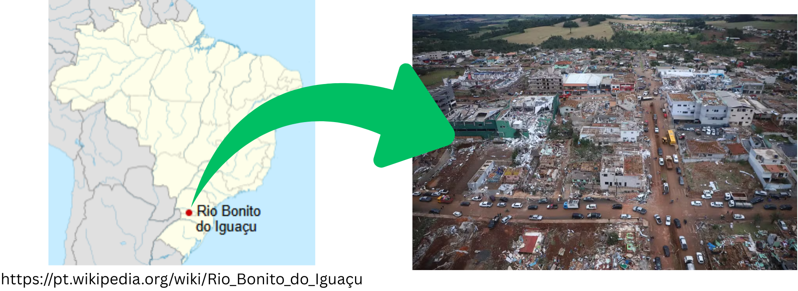
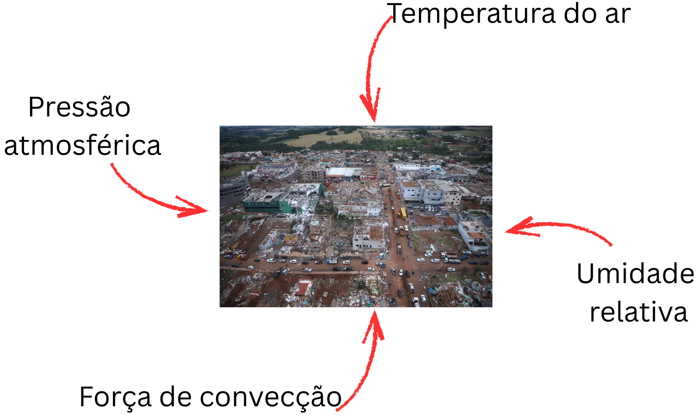
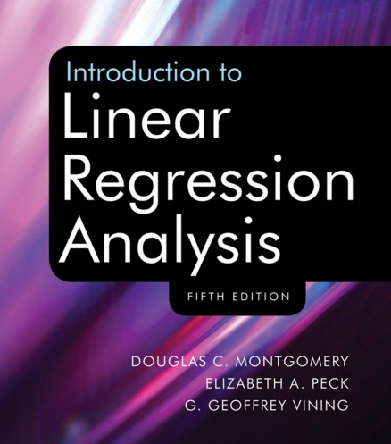
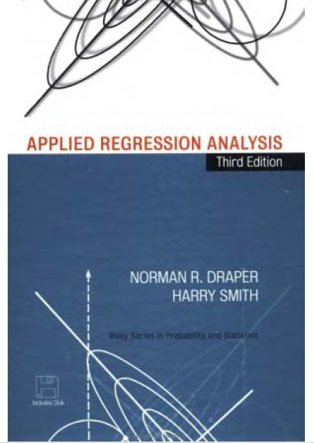

## Objetivo da Aula

::: {.callout-tip appearance="simple"}
-   Apresentar os conceitos de regressão linear simples.

-   Demonstrar a obtenção dos estimadores dos parâmetros por meio do método de mínimos quadrados.
:::

## Motivação

<br>

```{r , echo=FALSE, fig.align = 'center', out.width = '100%'}

```

------------------------------------------------------------------------

-   **Mês passado**

:newspaper: Tornado que atingiu o município de Rio Bonito do Iguaçu (PR)

```{r , echo=FALSE, fig.align = 'center', out.width = '100%'}

```

Fonte: https://g1.globo.com/sp/campinas-regiao

------------------------------------------------------------------------

```{r , echo=FALSE, fig.align = 'center', out.width = '100%'}

```

<br>

::: incremental
-   Fenômenos aleatório $\longrightarrow$ expressão matemática
:::

------------------------------------------------------------------------

::: meubox
::: meubox-title
Análise de regressão
:::

::: meubox-content
Conjunto de técnicas estatísticas aplicadas na investigação e modelagem da relação entre variáveis.
:::
:::

<br>

. . .

Os dois principais objetivos da análise são:

::: incremental
-   avaliar o efeito (ou relação) entre as variáveis;

-   predizer valores não observados.
:::

# Definição

## Ajustar um modelo

... *descrever* a relação entre as variáveis $X$ e $Y$

```{r}
#| echo: false
#| out.width: "70%"
#| fig.show: 'hide'
#| 
library(ggplot2)
library(fivethirtyeight)
library(gganimate)

movie_scores <- fandango |> 
  dplyr::rename(
    critics = rottentomatoes, 
    audience = rottentomatoes_user
  )

p <- movie_scores |> 
  ggplot() +
  aes(x = critics, y = audience) +
  geom_point(alpha = 0.5) + 
  geom_smooth(method = "lm", color = "purple", se = FALSE) +
  labs(
    x = "Variável x" , 
    y = "Variável y"
    ) +
  theme(
    axis.title = element_text(size=20),
    axis.text = element_text(size=20)
  )

p
```

::: panel-tabset
## Figura

```{r}
#| echo: false
#| out.width: "70%"
#| fig-align: "center"
p
```

## R

``` r
movie_scores |> 
  ggplot() +
  aes(x = critics, y = audience) +
  geom_point(alpha = 0.5) + 
  geom_smooth(method = "lm", color = "purple", se = FALSE) +
  labs(
    x = "Variável x" , 
    y = "Variável y"
    )
```
:::

## Notação

::: columns
::: {.column width="40%"}
-   **Y**: variável resposta

-   **x**: variável explicativa
:::

::: {.column width="60%"}
```{r}
#| out.width: "100%"
#| echo: false
p
```
:::
:::

## Modelo de regressão {#regression-model-1}

<br>

Um **modelo de regressão** é uma função que descreve a relação entre a variável resposta $Y$ e a variável explicativa $x$.

$$\begin{aligned} Y &= \color{black}{\textbf{Modelo}} + \text{Erro aleatório} \\[8pt]
&= \color{black}{\mathbf{f(x)}} + \epsilon \\[8pt]
&= \color{black}{\boldsymbol{\mu_{Y|x}}} + \epsilon \end{aligned}$$

## Modelo de regressão

::: columns
::: {.column width="30%"}
$$
\begin{aligned} Y &= \color{purple}{\textbf{Model}} + \text{Erro aleatório} \\[8pt]
&= \color{purple}{\mathbf{f(x)}} + \epsilon \\[8pt]
&= \color{purple}{\boldsymbol{\mu_{Y|x}}} + \epsilon 
\end{aligned}
$$
:::

::: {.column width="70%"}
```{r}
#| echo: false
m <- lm(audience ~ critics, data = movie_scores)

ggplot(data = movie_scores, 
       mapping = aes(x = critics, y = audience)) +
  geom_point(alpha = 0.5) + 
  geom_smooth(method = "lm", color = "purple", se = FALSE) +
  labs(x = "X", y = "Y") +
  theme_minimal() +
  theme(
    axis.text = element_blank(),
    axis.ticks.x = element_blank(), 
    axis.ticks.y = element_blank()
    )
```
:::
:::

## Modelo de regressão

<br>

::: columns
::: {.column width="40%"}
$$\begin{aligned} Y &= \color{purple}{\textbf{Model}} + \color{blue}{\textbf{Erro aleatório}} \\[8pt]
&= \color{purple}{\mathbf{f(x)}} + \color{blue}{\boldsymbol{\epsilon}} \\[8pt]
&= \color{purple}{\boldsymbol{\mu_{Y|x}}} + \color{blue}{\boldsymbol{\epsilon}} \\[8pt]
 \end{aligned}$$
:::

::: {.column width="60%"}
```{r}
#| echo: false
ggplot(data = movie_scores,
       mapping = aes(x = critics, y = audience)) +
  geom_point(alpha = 0.5) +
  geom_smooth(method = "lm", color = "purple", se = FALSE) +
  geom_segment(aes(x = critics, xend = critics, 
                   y = audience, yend = predict(m)), 
               color = "blue") +
  labs(x = "X", y = "Y") +
  theme(
    axis.text = element_blank(),
    axis.ticks.x = element_blank(),
    axis.ticks.y = element_blank()
  )
```
:::
:::

## Modelo de regressão linear simples

O modelo de regressão linear **simples** descreve a relação entre uma variável resposta ($Y$) e uma única variável explicativa ($x$), assumindo uma relação aproximadamente linear entre elas. Nesse caso, o modelo é dado por:

$$\Large{Y = \beta_0 + \beta_1 x + \epsilon}$$

::: incremental
-   $\beta_1$: inclinação da reta entre $x$ e $Y$
-   $\beta_0$: intercepto
-   $\epsilon$: erro aleatório
:::

## Modelo estimado

$$\Large{\hat{Y} = \hat{\beta}_0 + \hat{\beta}_1 x}$$

-   $\hat{\beta}_0$ e $\hat{\beta}_1$: parâmetros dos coeficientes da regressão.
-   Não há o termo aleatório!

## Estimação de parâmetros

```{r}
#| echo: false
ggplot(data = movie_scores, 
       mapping = aes(x = critics, y = audience)) +
  geom_point(alpha = 0.4) + 
  geom_abline(intercept = 32.3155, slope = 0.5187, color = "purple", size = 1) +
  geom_abline(intercept = 25, slope = 0.7, color = "gray") +
  geom_abline(intercept = 21, slope = 0.9, color = "gray") +
  geom_abline(intercept = 35, slope = 0.3, color = "gray") +
  labs(
    x = "Variável x" , 
    y = "Variável y"
    ) +
  theme(
    axis.title = element_text(size=20),
    axis.text = element_text(size=20)
  )
```

------------------------------------------------------------------------

::: meubox-lilas
***Resíduo***
:::

<br>

```{r}
#| warning: false
#| message: false
#| echo: false
#| fig-align: 'center'

ggplot(data = movie_scores, mapping = aes(x = critics, y = audience)) +
  geom_point(alpha = 0.5) +
  geom_smooth(method = "lm", color = "purple", se = FALSE) +
  geom_segment(aes(x = critics, xend = critics, y = audience, yend = predict(m)), color = "steel blue") +
  labs(
    x = "Variável x" , 
    y = "Variável y"
    ) +
  theme(
    axis.title = element_text(size=20),
    axis.text = element_text(size=20)
  ) +
  theme(legend.position = "none")
```

## $$\text{resíduo} = \text{valor observado} - \text{valor predito} = y - \hat{y}$$

::: meubox-lilas
***Método de mínimos quadrados***
:::

-   O resíduo da $i$-ésima observação é dado por

$$e_i = \text{valor observado} - \text{varlo predito} = y_i - \hat{y}_i$$

-   A **soma de quadrados** dos resíduos é dada por

$$e^2_1 + e^2_2 + \dots + e^2_n$$

-   O método de mínimos quadrados baseia-se na determinação de $\beta_0$ e $\beta_1$ tal que a soma de quadrados dos resíduos seja mínima.

------------------------------------------------------------------------

$$\frac{\partial S}{\partial\beta_0}=-2\sum_{i=1}^{n}(y_i-\hat{\beta}_0-\hat{\beta}_1x_i)=0$$

<br>

$$\frac{\partial S}{\partial\beta_1}=-2\sum_{i=1}^{n}(y_i-\hat{\beta}_0-\hat{\beta}_1x_i)x_i=0$$

```{r}
#| echo: false
sx <- round(sqrt(var(movie_scores$critics)), 4)
sy <- round(sqrt(var(movie_scores$audience)), 4)
r <- round(cor(movie_scores$critics, movie_scores$audience), 4)
xbar <- round(mean(movie_scores$critics), 4)
ybar <- round(mean(movie_scores$audience), 4)
```

## Exercício :tornado:

Recentemente, um tornado com ventos de até 250 km/h atingiu a região de Rio Bonito. Suponha que pesquisadores registraram a velocidade do vento em diferentes pontos da cidade e estimaram o percentual de residências danificadas em cada local. Os dados simulados são apresentados na Tabela 1.

------------------------------------------------------------------------

**Tabela 1** - Velocidade do vento e percentual de residências danificadas em diferentes pontos da cidade de Rio Bonito.

| Local | Velocidade do vento (km/h) | Danos em residências (%) |
|:------|:--------------------------:|:------------------------:|
| A     |            180             |            10            |
| B     |            200             |            25            |
| C     |            220             |            40            |
| D     |            230             |            50            |
| E     |            240             |            70            |
| F     |            250             |            85            |

Estimar o modelo de regressão linear simples.

## Utilizando o software R

<br>

::: columns
::: {.column width="50%"}
```{r}
#| output: false
#| code-line-numbers: "|1-4|6-14"

#data-frame
velocidade <- c(180,200,220,230,240,250)
danos <- c(10,25,40,50,70,85)
df_vento <- data.frame(velocidade, danos)

#diagrama de dispersão
df_vento |> 
  ggplot() +
  aes(x = velocidade, y = danos) +
  geom_point(size = 8) +
  labs(x = 'Velocidade do vento (km/h)', 
       y = 'Danos em residências (%)') +
  theme(axis.title = element_text(size=30),
        axis.text = element_text(size=30))
```
:::

::: {.column width="50%"}
```{r}
#| echo: false

#data-frame
velocidade <- c(180,200,220,230,240,250)
danos <- c(10,25,40,50,70,85)
df_vento <- data.frame(velocidade, danos)

#diagrama de dispersão
df_vento |> 
  ggplot() +
  aes(x = velocidade, y = danos) +
  geom_point(size = 8) +
  labs(x = 'Velocidade do vento (km/h)', 
       y = 'Danos em residências (%)') +
  theme(axis.title = element_text(size=30),
        axis.text = element_text(size=30))
```
:::
:::

------------------------------------------------------------------------

```{r}
#| echo: true

fit <- lm(danos~velocidade, data=df_vento)
fit
```

## Bibliografia

<br>

::: columns
::: {.column width="50%"}
```{r,echo=FALSE, fig.align='center', out.width='65%'}

```
:::

::: {.column width="50%"}
```{r,echo=FALSE, fig.align='center', out.width='58%'}

```
:::
:::

## Atividade prática

<br>

-   Abram a plataforma

```{r,echo=FALSE, fig.align='center', out.width='48%'}

```
