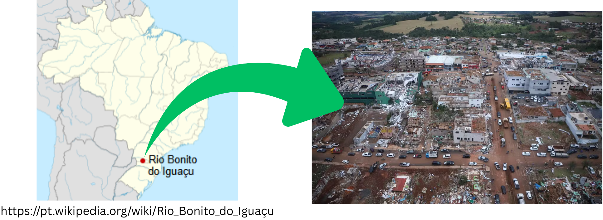
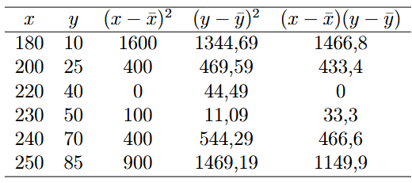
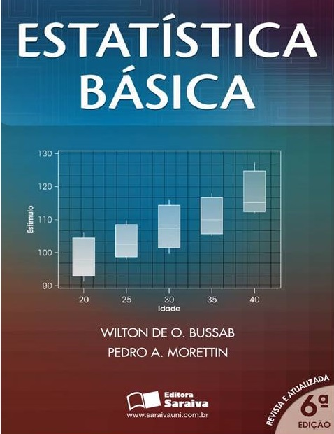

```{r setup, include=FALSE}
options(htmltools.dir.version = FALSE)
knitr::opts_chunk$set(echo = FALSE, 
                      comment = '',
                      message = FALSE,
                      warning = FALSE)
```
<style> 
#caixa {
  border: 1px solid;
  padding: 10px;
  box-shadow: 5px 10px blue;
}
div {
  text-align: justify;
  text-justify: inter-word;
}
</style>

<style type="text/css">
.remark-slide-content {
    font-size: 30px;
}
</style>

# Aula passada

<br>

&#9989; Teste de hipótese para diferença de médias

&#9989; Aplicação

<br>

```{r , echo=FALSE, fig.align = 'right', out.width = '30%'}
knitr::include_graphics('https://media3.giphy.com/media/v1.Y2lkPTc5MGI3NjExZDBtam9uODVmc3YzZGs5ZzZ0cTVlYXp6eTYwMW85eXJpNGRrOHlhMyZlcD12MV9pbnRlcm5hbF9naWZfYnlfaWQmY3Q9Zw/phK01HiDa7gfGnKoIX/giphy.gif')
```

---

# Objetivo da aula

<br>

<fieldset class="fldsetalert-class">
  <legend class="legendalert-class">
  </legend>
  Compreender e interpretar a relação entre duas variáveis quantitativas.
</fieldset>

```{r , echo=FALSE, fig.align = 'right', out.width = '30%'}
knitr::include_graphics('https://media2.giphy.com/media/v1.Y2lkPTc5MGI3NjExdHM4djZ6M3hrNmJkb3V2amt2amtsc2x5am1hNWNsenpvN2J0bHAxOCZlcD12MV9pbnRlcm5hbF9naWZfYnlfaWQmY3Q9Zw/kLOkqcrdC5mrCE7k7G/giphy.gif')
```

---

# Introdução

<br>

&#128240; Tornado que atingiu o município de Rio Bonito do Iguaçu (PR)

```{r , echo=FALSE, fig.align = 'center', out.width = '100%'}

```


Fonte: https://g1.globo.com/sp/campinas-regiao

---
# Introdução

```{r , echo=FALSE, fig.align = 'center', out.width = '100%'}
knitr::include_graphics('figuras/variaveis.png')
```

---

# Diagrama de dispersão


```{r, out.width="60%",fig.align='center'}
df <- mtcars
m <- lm(mpg~wt, data=df)
yhat <- m$coefficients[[1]]+(m$coefficients[[2]]*df$wt)

library(ggplot2)
library(patchwork)
p1 <- df |> 
  dplyr::mutate(yhat) |> 
  ggplot() +
  aes(x = wt, y = mpg) +
  geom_point(size = 8) +
  labs(x = 'Valores de x', 
       y = 'Valores y') +
  theme(axis.title = element_text(size=30),
        axis.text = element_text(size=30))
#
n <- nrow(df)
set.seed(42)
x <- rnorm(n,10,5)

erro <- rnorm(n,0,6)
y <- (3*x) + erro 

df2 <- data.frame(x,y)

p2 <- df2 |> 
  ggplot() +
  aes(x = x, y = y) +
  geom_point(size = 8) +
  labs(x = 'Valores de x', 
       y = 'Valores y') +
  theme(axis.title = element_text(size=30),
        axis.text = element_text(size=30))
#
xq <- seq(-12, 10, length.out = n) 
yq <- 2 + (3*xq) + (0.5*(xq^2)) + erro 
#yq <- 1 + (0.5 *(xq^2)) + erro
df3 <- data.frame(xq,yq)
p3 <- df3 |> 
  ggplot() +
  aes(x = xq, y = yq) +
  geom_point(size = 8) +
  labs(x = 'Valores de x', 
       y = 'Valores y') +
  theme(axis.title = element_text(size=30),
        axis.text = element_text(size=30))
#
yc <- 5 + erro
df4 <- data.frame(x,yc)
p4 <- df4 |> 
  ggplot() +
  aes(x = x, y = yc) +
  geom_point(size = 8) +
  labs(x = 'Valores de x', 
       y = 'Valores y') +
  theme(axis.title = element_text(size=30),
        axis.text = element_text(size=30))

p1


```

---

# Diagrama de dispersão


```{r, out.width="60%",fig.align='center'}
df <- mtcars
m <- lm(mpg~wt, data=df)
yhat <- m$coefficients[[1]]+(m$coefficients[[2]]*df$wt)

library(ggplot2)
library(patchwork)
p1 <- df |> 
  dplyr::mutate(yhat) |> 
  ggplot() +
  aes(x = wt, y = mpg) +
  geom_point(size = 8) +
  labs(x = 'Valores de x', 
       y = 'Valores y') +
  theme(axis.title = element_text(size=30),
        axis.text = element_text(size=30))
#
n <- nrow(df)
set.seed(42)
x <- rnorm(n,10,5)

erro <- rnorm(n,0,6)
y <- (3*x) + erro 

df2 <- data.frame(x,y)

p2 <- df2 |> 
  ggplot() +
  aes(x = x, y = y) +
  geom_point(size = 8) +
  labs(x = 'Valores de x', 
       y = 'Valores y') +
  theme(axis.title = element_text(size=30),
        axis.text = element_text(size=30))
#
xq <- seq(-12, 10, length.out = n) 
yq <- 2 + (3*xq) + (0.5*(xq^2)) + erro 
#yq <- 1 + (0.5 *(xq^2)) + erro
df3 <- data.frame(xq,yq)
p3 <- df3 |> 
  ggplot() +
  aes(x = xq, y = yq) +
  geom_point(size = 8) +
  labs(x = 'Valores de x', 
       y = 'Valores y') +
  theme(axis.title = element_text(size=30),
        axis.text = element_text(size=30))
#
yc <- 5 + erro
df4 <- data.frame(x,yc)
p4 <- df4 |> 
  ggplot() +
  aes(x = x, y = yc) +
  geom_point(size = 8) +
  labs(x = 'Valores de x', 
       y = 'Valores y') +
  theme(axis.title = element_text(size=30),
        axis.text = element_text(size=30))

p2


```

---

# Diagrama de dispersão


```{r, out.width="60%",fig.align='center'}
p4
```

---

# Diagrama de dispersão

```{r, out.width="60%",fig.align='center'}
p3
```

---

# Diagrama de dispersão - exercício 🌪️

<fieldset class="fldsetblock-class">
  <legend class="legendblock-class">
  </legend>
  Recentemente, um tornado com ventos de até 250 km/h atingiu a região de Rio Bonito. Suponha que pesquisadores registraram a velocidade do vento em diferentes pontos da cidade e estimaram o percentual de residências danificadas em cada local. 
</fieldset>

Utilizando os dados simulados da Tabela 1

&#9744; Construa um gráfico de dispersão, colocando a velocidade do vento no eixo $x$ e os danos em residências no eixo $y$.

&#9744; Observe o gráfico e descreva como as duas variáveis se relacionam.

---

# Diagrama de dispersão - exercício 🌪️

**Tabela 1** - Velocidade do vento e percentual de residências danificadas em diferentes pontos da cidade de Rio Bonito.

| Local | Velocidade do vento (km/h) | Danos em residências (%) |
| :---- | :------------------------: | :----------------------: |
| A     |             180            |            10            |
| B     |             200            |            25            |
| C     |             220            |            40            |
| D     |             230            |            50            |
| E     |             240            |            70            |
| F     |             250            |            85            |

---

# Exercício 🌪️ - Resolução

```{r, out.width="60%",fig.align='center',fig.cap='Diagrama de dispersão'}

velocidade <- c(180,200,220,230,240,250)
danos <- c(10,25,40,50,70,85)

df_vento <- data.frame(velocidade, danos)

df_vento |> 
  ggplot() +
  aes(x = velocidade, y = danos) +
  geom_point(size = 8) +
  labs(x = 'Velocidade do vento (km/h)', 
       y = 'Danos em residências (%)') +
  theme(axis.title = element_text(size=30),
        axis.text = element_text(size=30))
```

---

# Correlação

<br>

```{r,echo=FALSE, fig.align='center', out.width='100%'}
knitr::include_graphics('figuras/cor1.png')
```

---

# Correlação

```{r}
rho <- c('0,00 a 0,19', '0,20 a 0,39',
         '0,40 a 0,69', '0,70 a 0,89',
         '0,90 a 1,00')
interp <- c('Correlação bem fraca',
            'Correlação fraca',
            'Correlação moderada',
            'Correlação forte',
            'Correlação muito forte') 
df <- data.frame(rho,interp)

df |> 
  kableExtra::kbl(col.names = c('r','Interpretação'),
                  align = c('c')) |> 
  kableExtra::kable_classic(full_width = F, html_font = "Cambria") |> 
  kableExtra::footnote(general = "http://leg.ufpr.br/~silvia/CE003/node74.html ")
```

---

# Correlação

```{r , echo=FALSE, fig.align = 'left', out.width = '25%'}
knitr::include_graphics('https://i.giphy.com/media/v1.Y2lkPTc5MGI3NjExZTYzajA1dzk2bzdmMW55eXZtNXRpbHlzYzl4M2EwcDZpbmJncTE5OCZlcD12MV9pbnRlcm5hbF9naWZfYnlfaWQmY3Q9Zw/3ov9k9Ss9N3wO6FQ7C/giphy.gif')
```

.pull-left[
"A venda de sorte é fortemente correlacionada com o número de afogamentos."
]
.pull-right[
```{r , echo=FALSE, fig.align = 'center', out.width = '90%'}
knitr::include_graphics('figuras/espuria.jpg')
```
]

---

# Explicação

```{r , echo=FALSE, fig.align = 'center', out.width = '100%'}
knitr::include_graphics('figuras/cor_vs_casual.png')
```
<center><small>https://estatisticafacil.org/correlacao-vs-causalidade/</small></center>

---

# Correlação - exercício 🌪

Com base nos dados simulados de velocidade do vento e percentual de residências danificadas nos diferentes pontos da cidade de Rio Bonito, calcule o coeficiente de correlação de Pearson e interprete.

---

# Exercício 🌪️ - Resolução

```{r , echo=FALSE, fig.align = 'center', out.width = '100%'}

```

---

#Fechamento

```{r , echo=FALSE, fig.align = 'center', out.width = '80%'}
knitr::include_graphics('figuras/tempo.png')
```

---

#Fechamento

"O olhar estatístico é o primeiro passo para compreender fenômenos ambientais. O diagrama de dispersão e o coeficiente de correlação nos ajudam a enxergar padrões escondidos nos dados."

```{r , echo=FALSE, fig.align = 'right', out.width = '35%'}
knitr::include_graphics('https://media4.giphy.com/media/v1.Y2lkPTc5MGI3NjExeGlpcnRtOGY4YTk4NHkwb3Z6bjdxeHJuZXBweTFzOWp6dTkwbHd0dyZlcD12MV9pbnRlcm5hbF9naWZfYnlfaWQmY3Q9Zw/h2ZbNM01LYyTdX6Tnr/giphy.gif')
```

---

#Bibliografia

.pull-left[

```{r,echo=FALSE, fig.align='center', out.width='65%'}
knitr::include_graphics('figuras/mont7.png')
```
]

.pull-right[

```{r,echo=FALSE, fig.align='center', out.width='65%'}

```
]

---

#Atividade prática

- Abram a plataforma Moodle


```{r , echo=FALSE, fig.align = 'right', out.width = '35%'}
knitr::include_graphics('https://media0.giphy.com/media/v1.Y2lkPTc5MGI3NjExeDY2cmt5NWVodXM1OWMxOGo1MGRxcmJlZXljd2wzNjIyYmNtOG5hMyZlcD12MV9pbnRlcm5hbF9naWZfYnlfaWQmY3Q9Zw/IoP0PvbbSWGAM/giphy.gif')
```
