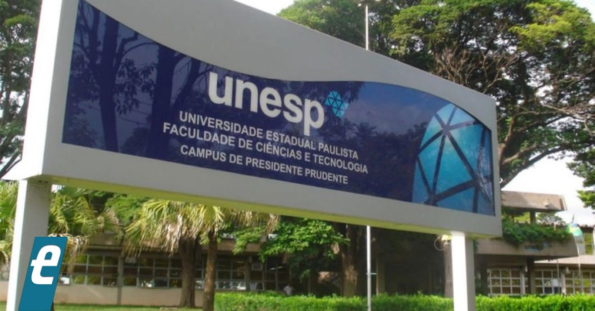
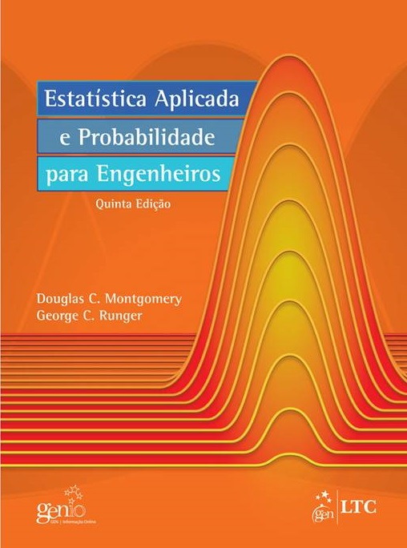
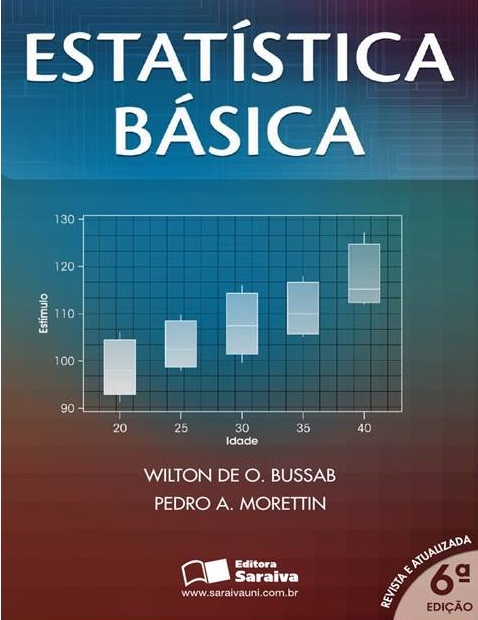

```{r setup, include=FALSE}
options(htmltools.dir.version = FALSE)
knitr::opts_chunk$set(echo = FALSE, 
                      comment = '',
                      message = FALSE,
                      warning = FALSE)
```
<style> 
#caixa {
  border: 1px solid;
  padding: 10px;
  box-shadow: 5px 10px blue;
}
div {
  text-align: justify;
  text-justify: inter-word;
}
</style>

<!--
# Porque estudar Estatística &#128526;

```{r , echo=FALSE, fig.align = 'right', out.width = '40%'}
knitr::include_graphics('https://media.giphy.com/media/1oBwBVLGoLteCP2kyD/giphy.gif')
```
-->

<!--acrescentar embed no link dos videos-->

<!--
<center>
<iframe width="560" height="315" src="https://www.youtube.com/embed/wV0Ks7aS7YI" frameborder="0" allow="accelerometer; autoplay; encrypted-media; gyroscope; picture-in-picture" allowfullscreen></iframe>
</center>
-->

# Formação &#127891;

&#10004; Bacharel em Estatística

```{r , echo=FALSE, fig.align = 'center', out.width = '35%'}

```

--

&#10004; Mestrado e Doutorado em Ciências

```{r , echo=FALSE, fig.align = 'center', out.width = '40%'}

```

---

# Apresentar-se &#128104;&#8205;&#127891;

- Nome

- Linha de pesquisa

- Se você tivesse que descrever a disciplina (Estatística Aplicada) em uma palavra, qual seria?

```{r , echo=FALSE, fig.align = 'right', out.width = '60%'}
knitr::include_graphics('https://media.giphy.com/media/TKNGghpLhaz9XH1tSj/giphy.gif')
```

---

# Porque estudar Estatística &#128526;

.pull-left[
- Análise de Dados Ambientais.
<!-- A estatística é fundamental para a coleta e análise de dados ambientais, permitindo que os alunos interpretem informações sobre qualidade da água, poluição do ar, biodiversidade e outros indicadores ambientais.-->

- Modelagem e Previsão.
<!-- A estatística é crucial para a modelagem de fenômenos ambientais e a previsão de tendências, como mudanças climáticas, impacto de projetos de engenharia e comportamento de ecossistemas.-->

- Pesquisa e Publicação.
<!-- Conhecimentos em estatística são essenciais para a realização de pesquisas rigorosas e a publicação de resultados em revistas acadêmicas, aumentando a credibilidade e a relevância do trabalho dos alunos na comunidade científica.-->
]
.pull-right[
```{r , echo=FALSE, fig.align = 'center', out.width = '65%'}
knitr::include_graphics('https://media.giphy.com/media/1oBwBVLGoLteCP2kyD/giphy.gif')
```
]

---

# Objetivo da disciplina &#127919;

A disciplina de estatística aplicada têm como objetivos:

- capacitar os estudantes a **escolher os métodos estatísticos** mais apropriados para suas análises.

- **fornecer as ferramentas** necessárias para que os estudantes possam iniciar e conduzir uma análise de dados. 

```{r , echo=FALSE, fig.align = 'center', out.width = '40%'}
knitr::include_graphics('https://media.giphy.com/media/ne0ozzSO13QhNZDSRo/giphy.gif')
```

---

# Previsão dos conteúdos &#128197;

- **13/03**: Apresentação da disciplina. Aplicação de questionário. Revisão dos conceitos básicos. 

- **20/03**: Intervalo de confiança para uma amostra. Teste de hipótese para duas amostras.

- **27/03**: Modelo de regressão linear simples e múltiplo.  

- **~~03/04~~**: Recesso.

- **10/04**: Análise de variância.

- **17/04**: Análise de agrupamentos.

- **24/04**: Elaboração do resumo expandido. 

---

- **~~01/05~~**: Recesso.

- **08/05**: Elaboração do resumo expandido.

- **15/05**: Elaboração do resumo expandido.

- **22/05**: Entrega do resumo expandido.

- **29/05**: Avaliação de recuperação.

```{r , echo=FALSE, fig.align = 'right', out.width = '30%'}
knitr::include_graphics('https://media.giphy.com/media/H8mFOgIyWfFpWmJl9U/giphy.gif')
```

---

# Referências &#128218;

&#128214; MONTGOMERY, Douglas C.; Runger, George G. **Estatística Aplicada e Probabilidade para Engenharias**. 6ed. Rio de Janeiro: LTC, 2016.

```{r , eval = TRUE, echo=FALSE, fig.align = 'center', out.width = '35%'}

```

---

# Referências &#128218;

&#128214; BUSSAB, Wilton de Oliveira; MORETTIN, Pedro Alberto. **Estatística básica**. 5ed. São Paulo: Saraiva, 2004. 

```{r , eval = TRUE, echo=FALSE, fig.align = 'center', out.width = '35%'}

```

---

# Referências &#128218;

&#128214; BRUCE, Peter; BRUCE, Andrew. **Estatística Prática para Cientistas de Dados**. 1ed. Rio de Janeiro: Alta Books, 2019. 

<br>

&#128214; TOLEDO, Geraldo L.; OVALLE, Ivo I. **Estatística Básica**. 2ed. São Paulo: Atlas, 2008.

<br>

&#128214; HAIR, Joseph F et al. **Análise Multivariada de Dados**. 6ed. Porto Alegre: Bookman, 2009.

```{r , echo=FALSE, fig.align = 'right', out.width = '20%'}
knitr::include_graphics('https://media.giphy.com/media/Y2bM68y94nxSXYkCaI/giphy.gif')
```

---

# Critério de avaliação &#128221;

&#10004; A média final será calculada da seguinte forma
		$$MF=0,60NR+0,25NL+0,15NQ,$$
em que $NR$ é a nota do resumo expandido (10 pontos), $NL$ é a soma de cincos atividades em laboratório (cada aula - 2 pontos) e $NQ$ é a nota média de quizes (cada quiz com 10 pontos). 

<br>

--

&#128680; As atividades devem ser entregues sem rigor acadêmico serão **penalizados**.

--

&#128680; O total de atividades em laboratório são seis. O aluno pode deixar de fazer uma atividade ou o aluno que entregar todas as atividades pode excluir a menor nota.

---

&#10004; Atribuição dos conceitos
```{r, echo=FALSE}
library(knitr)
library(kableExtra)
library(tidyverse)

# Criando uma tabela com kable
tabela <- data.frame(
  MF = c("[9, 10]", "[7, 9[", "[5, 7[", "< 5"),
  Conceito = c("A", "B", "C", "D")
)

# Renderizando a tabela com linhas horizontais
#kable(tabela, format = "html", table.attr = "class='table table-striped'", align = c('c'))

tabela |> 
  kbl(caption = "", align = c('c')) |> 
  kable_classic(full_width = F) |> 
  kable_styling(font_size = 25)
```

---

&#10004; Se $MF<7$, uma prova de recuperação escrita (com todo o conteúdo) será aplicada no dia 19-12. A média final reculada será dada por
$$MF_r=\frac{MF+NRec}{2},$$
em que $NRec$ é a nota da prova de recuperação.

<br>


&#128680; Em caso de cola comprovada, as notas serão **zeradas**.

---

#Sala virtual &#128187;

&#10004; Tolerância de 5 minutos.

<br>
--
&#10004; Quando for tirar alguma dúvida ou conversar, ligar a câmera. 

<br>
--
&#10004; Usar a mão levanta, quando quiser tirar alguma dúvida.

<br>
--
&#10004; Se precisar faltar por motivo de força maior, estudar o conteúdo perdido antes da próxima aula.

<br>
--

&#10004; Dexiar o *Software* livre Jamovi aberto.

