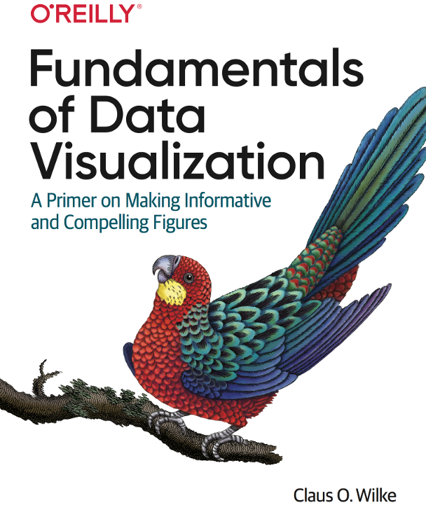

```{r setup, include=FALSE}
options(htmltools.dir.version = FALSE)
knitr::opts_chunk$set(echo = FALSE, 
                      comment = '',
                      message = FALSE,
                      warning = FALSE)
```
<style> 
#caixa {
  border: 1px solid;
  padding: 10px;
  box-shadow: 5px 10px blue;
}
div {
  text-align: justify;
  text-justify: inter-word;
}
</style>

# Parte 1 - quiz

&#10004; Responder o *Quiz1* que no **bloco Quiz** no moodle.

<br>

&#10004; Leitura dos sub-capítulos 2.1 a 2.2 e 3.1 a 3.4  

```{r , eval = TRUE, echo=FALSE, fig.align = 'center', out.width = '35%'}
knitr::include_graphics('figuras/fig8.jpg')
```

---

# Parte 2 - Prática com rmarkdown

```{r,echo=FALSE, fig.align='center', out.width='20%'}
knitr::include_graphics('figuras/rmarkdown.png')
```

<br>

Criar **dois arquivos** Rmd

.pull-left[
```{r,echo=FALSE, fig.align='left', out.width='25%'}

```
]

.pull-right[
- um para gerar um **relatório**

- um para gerar uma **apresentação**
]

---

# Apresentação

Faça uma apresentação de três slides contendo:

- Título;

- Resumo do seu TCC;

- As principais referências utilizadas no TCC.

<br>

.pull-left[
Passos para criar o arquivo Rmd
```{r,echo=FALSE, fig.align='center', out.width='25%'}

```
]

.pull-right[
- File

- New file

- Rmarkdown

- Presentation

- Marcar HTML(ioslides)

- Clicar em ok
]

---

&#10004; Inserir título, o nome e a data

```yaml
---
title: "Untitled"
author: "Autor"
date: '00-00-0000'
output: ioslides_presentation
---
```

&#10004; Trocar R Markdown (linha 12) por Resumo


&#10004; Trocar Slide with Bullets (linha 18) por Referências

&#10004; Apagar o texto da linha 24 em diante

&#10004; Trocar o texto das linhas 14 a 16 pelo seu resumo do TCC

---

Sintaxes que podem ser utilizadas

.pull-left[
**Sintaxe**

```markdown
 *itálico* 
```
]

.pull-right[
**Resultado**

*itálico*
]


.pull-left[
```markdown
 **negrito** 
```
]

.pull-right[
**negrito**
]

---

Para fazer o download do arquivo em html, faça o seguinte:

- do lado direito do Rstudio, selecione o arquivo em html marcando o quadrado branco.

- clique na engrenagem azul (pelo menos parece azul) da aba file do lado direito

- selecione Copy to...

- selecione o diretório

- clique em salvar.

<br>

Depois de finalizado, anexar o arquivo em html na **Atividade 1** no **bloco Conceitos básicos de estatística**.

---

# Relatório


.pull-left[
Reproduzir um trecho do livro
```{r,echo=FALSE, fig.align='center', out.width='70%'}
knitr::include_graphics('figuras/mont7.png')
```
]

.pull-right[
Sub-capítulo 1.1 e 1.1.1
]

<br>

O livro pode ser obtido pela biblioteca virtual [http://portal.utfpr.edu.br/biblioteca/bibliotec](http://portal.utfpr.edu.br/biblioteca/bibliotec)

---

.pull-left[
Passos para criar o arquivo Rmd
```{r,echo=FALSE, fig.align='center', out.width='25%'}

```
]

.pull-right[
- File

- New file

- Rmarkdown

- Document

- PDF

- Clicar em ok
]

<br>

**Observação**: não há necessidade de figuras.

---

Para fazer o download do arquivo em html, faça o seguinte:

- do lado direito do Rstudio, selecione o arquivo em html marcando o quadrado branco.

- clique na engrenagem azul (pelo menos parece azul) da aba file do lado direito

- selecione Copy to...

- selecione o diretório

- clique em salvar.

<br>

Depois de finalizado, anexar o arquivo em html na **Atividade 2** no **bloco Conceitos básicos de estatística**.

---

# Próxima aula

&#10004; Leitura dos Capítulos 1 a 5 

```{r,echo=FALSE, fig.align='center', out.width='35%'}

```

[Fundamentals of Data Visualization](https://clauswilke.com/dataviz/)
