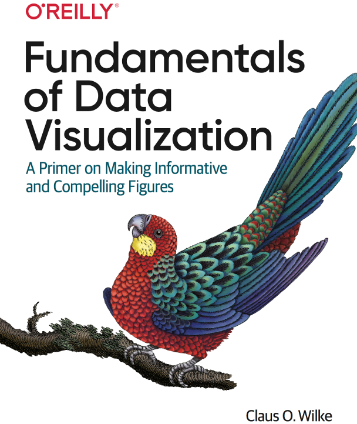
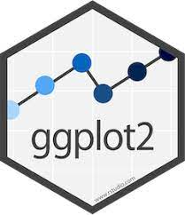

```{r setup, include=FALSE}
options(htmltools.dir.version = FALSE)
knitr::opts_chunk$set(echo = FALSE, 
                      comment = '',
                      message = FALSE,
                      warning = FALSE)
```
<style> 
#caixa {
  border: 1px solid;
  padding: 10px;
  box-shadow: 5px 10px blue;
}
div {
  text-align: justify;
  text-justify: inter-word;
}
</style>

# Fundamentos básicos

.left-column[
```{r,echo=FALSE, fig.align='center', out.width='95%'}

```
]
.right-column[

+ Visualização de dados é uma parte arte e uma ciência
{{content}}

]

--

+ Uma visulização de dados precisa transmitir os dados com precisão e deve ser esteticamente agradável.

---

- Valores de dados convertidos de forma sistemática e lógica nos elementos visuais.

```{r,echo=FALSE, fig.align='center', out.height='30%'}
plot(mtcars$mpg, mtcars$disp)
```
---

- Para visualização 2D de dados, precisamos de duas escalas de posição.

```{r,echo=FALSE, fig.align='center', out.width='50%'}
library(tidyverse)

mtcars |> 
  ggplot() +
  labs(x='Eixo x', y='Eixo y') +
  theme(axis.title=element_text(size=14))
```

---

Existem três casos de uso fundamentais para cores:

--

- distinguir grupos de dados.

--

- representar valores de dados.

--

- destacar informações.

---

# Tipos de gráficos

- Valores para algum conjunto de categorias

  + gráficos de barras
  
--

- Distribuições

  + Histograma, box-plot
  
--

- Pares ordenados

  + Gráfico de dispersão, correlograma, gráfico de linhas

--

- Dados geoespaciais
  + mapas

--

- Incertezas

  + Gráficos de barras com barras de erros
  
---

# Pacote ggplot2

.left-column[
```{r,echo=FALSE, fig.align='center', out.width='75%'}

```
]
.right-column[

+ Creado por **Hadley Wickham**, em 2005
{{content}}

]

--

+ Baseado no livro [The Grammar of Graphics ](https://link.springer.com/book/10.1007/0-387-28695-0) de **Leland Wilkinson**
{{content}}

--

+ O gráfico representa o mapeamento dos dados em:

  - atributos estéticos (posição, cor, forma, tamanho) 
  
  - de formas geométricas (pontos, linhas, barras, caixas)
{{content}}

---

.pull-left[
```{r,echo=FALSE, fig.align='center', out.width='60%'}
knitr::include_graphics('https://media.giphy.com/media/heIX5HfWgEYlW/giphy.gif')
```
]

.pull-right[
```{r, eval=FALSE, echo=TRUE}
library(ggplot2)
```

]

- Gráfico de dispersão (de pontos)

- Gráfico de linhas

- Gráfico de barras

- Histograma

- Boxplot

- Gráfico de linhas

---

# Atividade 3

.pull-left[
```{r,echo=FALSE, fig.align='center', out.extra='5%'}
library(tidyverse)
library(dados)
library(ggthemes)

pinguins |>
  drop_na(comprimento_bico) |>
  ggplot() +
  aes(x = massa_corporal,
    y = comprimento_bico,
    color = especie,
    shape = especie
  ) +
  geom_point(alpha = 0.8) +
  theme_minimal() +
  scale_colour_brewer(
    type = "qual",
    palette = 2
  ) +
  labs(title = 'Características de pinguins são positivamente correlacionadas',
       colour = 'Espécie',
       shape = 'Espécie',
       x= 'Massa corporal',
       y='Comprimento do bico') +
  theme(plot.title=element_text(hjust = 0.5))
```
]

.pull-right[
- adicione o tema `theme_minimal` usando o pacote ggthemes
- adicione a escala de cor brewer aos pontos, com a escala
do tipo qualitativa, e a paleta n.2 
- adicione um título informativo com a função labs().
]

---

# Próxima aula

.pull-left[

&#10004; Leitura Capítulo 7

- Estimativa pontual

- Distribuições amostrais e Teorema central do limite

- Erro padrão: reportando uma estimativa pontual

&#10004; Leitura Capítulo 8

- Introdução

- Intervalo de confiança para a média de uma distribuição normal, variância desconhecida
]

.pull-right[
```{r,echo=FALSE, fig.align='center', out.width='65%'}
knitr::include_graphics('figuras/mont7.png')
```
]

