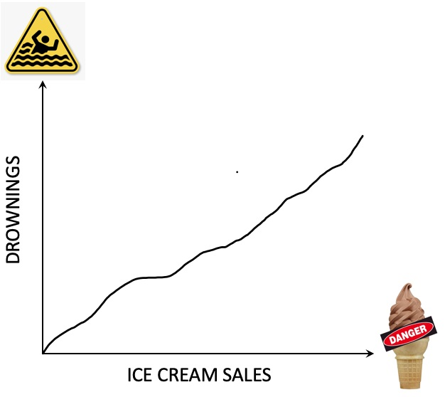
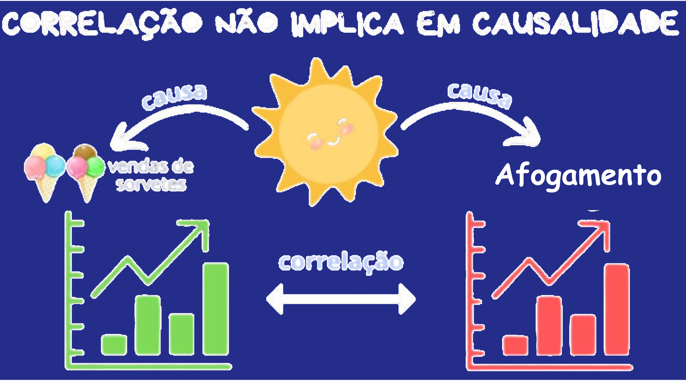

```{r setup, include=FALSE}
options(htmltools.dir.version = FALSE)
knitr::opts_chunk$set(echo = FALSE, 
                      comment = '',
                      message = FALSE,
                      warning = FALSE)
```
<style> 
#caixa {
  border: 1px solid;
  padding: 10px;
  box-shadow: 5px 10px blue;
}
div {
  text-align: justify;
  text-justify: inter-word;
}
</style>

<style type="text/css">
.remark-slide-content {
    font-size: 30px;
}
</style>

# Modelo de regressão

```{r , echo=FALSE, fig.align = 'center', out.width = '70%'}
knitr::include_graphics('https://media.giphy.com/media/v1.Y2lkPTc5MGI3NjExNmlqY3J1bTc0Nnc3ZmRsdWQxNTdoejluMWp1b2Y0dXIwYnUwM2UxYyZlcD12MV9pbnRlcm5hbF9naWZfYnlfaWQmY3Q9Zw/RCtKcMeeIlIFskmH7C/giphy.gif')
```

--

- **Variáveis** associada à um fenômeno

--

- Fazer uma **representação matemática**

<center><small>variável resposta = variáveis explicativas + termo aleatório </small></center>

---

# Modelo de regressão

&#127919; Estudar a **associação** entre duas ou mais variáveis.


```{r, out.width="50%",fig.align='center'}
df <- mtcars
m <- lm(mpg~wt, data=df)
yhat <- m$coefficients[[1]]+(m$coefficients[[2]]*df$wt)

library(ggplot2)
df |> 
  dplyr::mutate(yhat) |> 
  ggplot() +
  aes(x = wt, y = mpg) +
  geom_point(size = 8) +
  labs(x = 'Valores de x', 
       y = 'Valores y') +
  theme(axis.title = element_text(size=30),
        axis.text = element_text(size=30))
```

--

- Relação **linear** entre as variáveis.

---

# Correlação

- Quantificar o grau de relação entre duas variáveis.

--

- Correlação de Pearson

Dado um conjunto de dados $\{(x_1,y_1),\ldots,(x_n,y_n)\}$ consistindo de $n$ pares, o coeficiente de correlação de Pearson é dado por

$$r=\frac{\sum\limits_{i=1}^{n}x_iy_i-n\bar{x}\bar{y}}{\sqrt{\sum\limits_{i=1}^{n}x_i^2-n\bar{x}^2}\sqrt{\sum\limits_{i=1}^{n}y_i^2-n\bar{y}^2}}$$

---

```{r}
rho <- c('0,00 a 0,19', '0,20 a 0,39',
         '0,40 a 0,69', '0,70 a 0,89',
         '0,90 a 1,00')
interp <- c('Correlação bem fraca',
            'Correlação fraca',
            'Correlação moderada',
            'Correlação forte',
            'Correlação muito forte') 
df <- data.frame(rho,interp)

df |> 
  kableExtra::kbl(col.names = c('r','Interpretação'),
                  align = c('c')) |> 
  kableExtra::kable_classic(full_width = F, html_font = "Cambria") |> 
  kableExtra::footnote(general = "http://leg.ufpr.br/~silvia/CE003/node74.html ")
```

---

# Cuidado com a interpretação

```{r , echo=FALSE, fig.align = 'left', out.width = '25%'}
knitr::include_graphics('https://i.giphy.com/media/v1.Y2lkPTc5MGI3NjExZTYzajA1dzk2bzdmMW55eXZtNXRpbHlzYzl4M2EwcDZpbmJncTE5OCZlcD12MV9pbnRlcm5hbF9naWZfYnlfaWQmY3Q9Zw/3ov9k9Ss9N3wO6FQ7C/giphy.gif')
```

.pull-left[
"A venda de sorte é fortemente correlacionada com o número de afogamentos."
]
.pull-right[
```{r , echo=FALSE, fig.align = 'center', out.width = '90%'}

```
]

---

# Explicação

```{r , echo=FALSE, fig.align = 'center', out.width = '100%'}

```
<center><small>https://estatisticafacil.org/correlacao-vs-causalidade/</small></center>

---

# Modelo de regressão linear simples

- **Uma** variável explicativa 

```{r, out.width="50%",fig.align='center', fig.cap='Gráfico de dispersão'}
df <- mtcars
m <- lm(mpg~wt, data=df)
yhat <- m$coefficients[[1]]+(m$coefficients[[2]]*df$wt)

library(ggplot2)
df |> 
  dplyr::mutate(yhat) |> 
  ggplot() +
  aes(x = wt, y = mpg) +
  geom_point(size = 8) +
  labs(x = 'Valores de x', 
       y = 'Valores y') +
  theme(axis.title = element_text(size=30),
        axis.text = element_text(size=30))
```

---

# Modelo de regressão linear múltipa

- **Duas** variáveis explicativas  

```{r}
mm <- lm(mpg~+disp+wt, data=df)
ymhat <- mm$coefficients[[1]]+
  (mm$coefficients[[2]]*df$disp)+
  (mm$coefficients[[3]]*df$wt)

library(plotly)
df_novo <- df |> 
  dplyr::mutate(ymhat)

p <- plot_ly(
  df_novo, 
  x = ~wt, y = ~mpg, z = ~disp) |> 
  add_markers() |> 
  layout(
    scene = list(xaxis = list(title = 'Valores de x1'),
        yaxis = list(title = 'Valores de y'),
        zaxis = list(title = 'Valores de x2'))
        )

htmltools::tagList(p)
```

---

# Adequação do modelo

<center>variável resposta = variáveis explicativas + termo aleatório </center>

--

Usando **notação matemática**:

$$y=\beta_0+\beta_1x_1+\ldots\beta_px_p+\varepsilon$$
em que o erro aleatório satisfaz as seguintes características:

--

- segue distribuição normal com média zero e variância $\sigma^2$.

--

- a variância deve ser constante.

--

- os erros devem ser independentes.

---

# Roteiro da análise de regressão

.pull-left[
]
.pull-right[
```{r , echo=FALSE, fig.align = 'center', out.width = '75%'}
knitr::include_graphics('https://i.giphy.com/media/v1.Y2lkPTc5MGI3NjExMmZvYXZieWxqZnVrMmJucDlvNTF5ZjR4bjN2dHAwcmwyeDN3czI1YiZlcD12MV9pbnRlcm5hbF9naWZfYnlfaWQmY3Q9Zw/HZrx8kjIA7lyeTqXVM/giphy.gif')
```
]

- Fazer um gráfico de dispersão;

--

- Determinar a correlação entre as variáveis;

--

- Estimar o modelo de regressão linear;

--

- Análise de resíduo:
  - Teste de normalidade

---

- Análise de resíduo:

  - Teste de homogeneidade de variâncias
  
  As hipóteses testadas são:
  
  $H_0$: as variâncias são homogêneas vs   $H_1$: as variâncias são heterogêneas
  
--
  
  O critério de rejeição:
  
  $\rightarrow$ rejeitar $H_0$ se $p$-valor < $\alpha$.
  
---
- Análise de resíduo:

  - Teste de Durbin-Watson
  
  As hipóteses são:
  
  $H_0$: os erros são independentes vs   $H_1$: os erros são dependentes

--
  
  O critério de rejeição:
  
  $\rightarrow$ rejeitar $H_0$ se $p$-valor < $\alpha$.
  
--

- Fazer as inferências.

---

# Exemplo 1

Na engenharia de recursos hídricos, a estimativa dos tamanhos dos reservatórios depende de estimativas acuradas do escoamento da água no rio que está sendo confinado. Em alguns rios, registros históricos de longa duração de tais dados de escoamento são difíceis de obter. Já os dados meteorológicos sobre precipitação estão disponíveis para muitos anos do passado. Portanto, é útil determinar a relação entre escoamento e precipitação.

---

Essa relação pode ser usada para fazer uma estimativa do escoamento nos anos nos quais apenas medidas de precipitação foram feitas. Os seguintes dados estão disponíveis para um rio que deve ser estancado:

- Precipitação:
```{r}
x <- c(117.4,123.2,99.3,	91.7,	111.5,	
112.0,	
102.1,	
106.8)
x
```

- Escoamento:
```{r}
y <- c(19.6,18.5,
17.1,
12.9,
18.4,
18.1,
15.5,
18.1)
y
```

---

# Exemplo 2

A energia elétrica consumida mensalmente por uma indústria química está relacionada à temperatura média ambiente, ao número de dias do mês, à pureza média do produto e às toneladas do produto produzido. Os dados históricos do ano passado estão disponíveis no arquivo `dados de energia elétrica` no bloco `Conjunto de dados` do moodle.

Utilizando os dados de energia elétrica, fazer uma análise de regressão.

---

# Próxima aula

.pull-left[

&#10004; Leitura Capítulo 6

- Subcapítulos 6.3 e 6.4
]

.pull-right[
```{r,echo=FALSE, fig.align='center', out.width='65%'}

```
]

---

# Atividade - Aula3

A atividade consiste na análise de um conjunto de dados referente a preços de imóveis, que foi coletado com o intuito de investigar os fatores que influenciam o valor das propriedades em uma determinada região. As variáveis disponíveis para análise incluem: data da compra, idade da casa, localização, distância até a estação MRT mais próxima, preço da casa por área unitária e número de lojas de conveniência nas proximidades.

O objetivo desta atividade é realizar uma análise de regressão que permita modelar o preço da casa por área unitária com base nas variáveis explicativas. A análise deverá incluir:

---

- Apresentar a matrix de correlação.

- Estimação do modelo de regressão.

- Verificar a adequação do modelo.

- Interpretação das estimativas dos parâmetros.

Os dados estão disponíveis no arquivo `dados de imóvel` no bloco `Conjunto de dados` do moodle.
