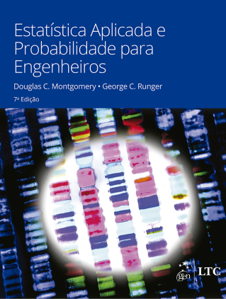

```{r setup, include=FALSE}
options(htmltools.dir.version = FALSE)
knitr::opts_chunk$set(echo = FALSE, 
                      comment = '',
                      message = FALSE,
                      warning = FALSE)
```
<style> 
#caixa {
  border: 1px solid;
  padding: 10px;
  box-shadow: 5px 10px blue;
}
div {
  text-align: justify;
  text-justify: inter-word;
}
</style>

# Fundamentos básicos

---

# Próxima aula

.pull-left[

&#10004; Leitura Capítulo 13

- Subcapítulos 6.3 e 6.4


]

.pull-right[
```{r,echo=FALSE, fig.align='center', out.width='65%'}

```
]

