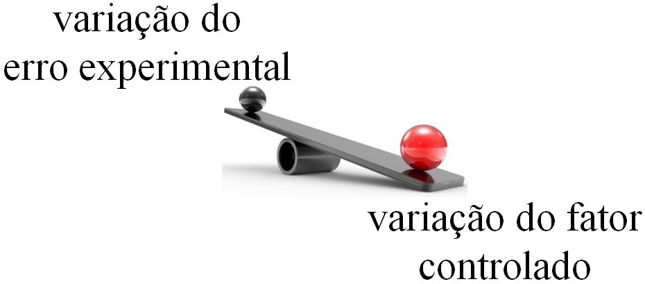

```{r setup, include=FALSE}
options(htmltools.dir.version = FALSE)
knitr::opts_chunk$set(echo = FALSE, 
                      comment = '',
                      message = FALSE,
                      warning = FALSE)
```
<style> 
#caixa {
  border: 1px solid;
  padding: 10px;
  box-shadow: 5px 10px blue;
}
div {
  text-align: justify;
  text-justify: inter-word;
}
</style>

<style type="text/css">
.remark-slide-content {
    font-size: 30px;
}
</style>

# Motivação

<fieldset class="fldsetblock-class">
  <legend class="legendblock-class">
    Dados experimentais
  </legend>
 dados são coletados em um ambiente controlado.
</fieldset>

<br>

```{r,echo=FALSE, fig.align='center', out.width='60%'}
knitr::include_graphics('figuras/experimento2.png')
```

---

# Conceitos básicos

<fieldset class="fldsetalert-class">
  <legend class="legendalert-class">
    Erro experimental
  </legend>
  é a variação ao acaso entre observações.
</fieldset>

<br>

```{r,echo=FALSE, fig.align='center', out.width='60%'}
knitr::include_graphics('figuras/variacao_acaso.png')
```

---

<fieldset class="fldsetalert-class">
  <legend class="legendalert-class">
    Fator
  </legend>
  é a variável independente (ou controlada).
</fieldset>

<br>

```{r,echo=FALSE, fig.align='center', out.width='60%'}
knitr::include_graphics('figuras/experimento2.png')
```

---

<fieldset class="fldsetalert-class">
  <legend class="legendalert-class">
    Níveis
  </legend>
  são as categorias ou valores no domínio de um fator.
</fieldset>

<br>

```{r,echo=FALSE, fig.align='center', out.width='60%'}
knitr::include_graphics('figuras/experimento2.png')
```

---

<fieldset class="fldsetalert-class">
  <legend class="legendalert-class">
    Unidade experimental
  </legend>
  é o objeto que recebe os níveis.
</fieldset>

<br>

```{r,echo=FALSE, fig.align='center', out.width='60%'}
knitr::include_graphics('figuras/experimento2.png')
```

---

<fieldset class="fldsetalert-class">
  <legend class="legendalert-class">
    Variável resposta
  </legend>
  é a variável de dependente.
</fieldset>

<br>

```{r,echo=FALSE, fig.align='center', out.width='60%'}
knitr::include_graphics('figuras/experimento2.png')
```

---

<fieldset class="fldsetexample-class">
  <legend class="legendexample-class">
    Exercício 1
  </legend>
  Pesquisadores testam três meios filtrantes em mini-zonas húmidas (mesocosmos) para remoção de nitrato: cascalho, areia grossa e carvão ativado. Para cada meio eles montam 4 mesocosmos idênticos, alimentam com água com concentração conhecida de nitrato e medem a redução percentual de nitrato após 7 dias.<br/> 
</fieldset>

Identifique o **fator**, os **níveis**, a **variável resposta** e a **unidade experimental**. 
	
---

# Princípios básicos da experimentação

<fieldset class="fldsetalert-class">
  <legend class="legendalert-class">
    Repetição
  </legend>
  é o número de vezes que os níveis aparecem no experimento
</fieldset>

<br>

```{r,echo=FALSE, fig.align='center', out.width='100%'}
knitr::include_graphics('figuras/repeticao.png')
```

---

<fieldset class="fldsetalert-class">
  <legend class="legendalert-class">
    Aleatorização
  </legend>
  é o princípio de distribuir aleatoriamente os níveis nas unidades experimentais.
</fieldset>

<br>

```{r,echo=FALSE, fig.align='center', out.width='95%'}
knitr::include_graphics('figuras/sorteio.png')
```

---

<fieldset class="fldsetalert-class">
  <legend class="legendalert-class">
    Controle local
  </legend>
  é uma forma de controlar o fator de ruído.
</fieldset>

<br>

```{r,echo=FALSE, fig.align='center', out.width='100%'}
knitr::include_graphics('figuras/bloco.png')
```

---

# Delineamento simples

<fieldset class="fldsetalert-class">
  <legend class="legendalert-class">
    Delineamento experimental
  </legend>
  Forma como os níveis são designados a unidade experimental.
</fieldset>

---

# Análise de variância (ANOVA)

- é uma análise baseado na decomposição da variabilidade total do experimento.

<br>

```{r,echo=FALSE, fig.align='center', out.width='75%'}

```

---

# Análise de variância (ANOVA)

- é uma análise baseado na decomposição da variabilidade total do experimento.

```{r,echo=FALSE, fig.align='center', out.width='75%'}
knitr::include_graphics('figuras/comparacao5.jpg')
```

---

# Experimentos fatoriais

- **Há** mais de um fator no experimento.

--

- Considerar experimentos com **dois** fatores. 

<br>

--

- O modelo é dado por

$$y_{ijk}=\mu+\tau_i+\alpha_j+(\tau\alpha)_{ij}+e_{ijk}$$
com $i=1,\ldots,a$, $j=1,\ldots,b$ e $k=1,\ldots,r$.

---

A estatística do teste é dada por

```{r}
library(kableExtra)
causa <- c('FatorA','FatorB','Interação','Resíduo','Total')
gl <- c('b-1','a-1','(a-1)(b-1)','ab(r-1)','abr-1')
sq <- c('SQA','SQB','SQInt','SQRes','SQTotal')
qm <- c('QMA','QMB','QMInt','QMRes','---')
f0 <- c('QMA/QMRes','QMB/QMRes','QMInt/QMRes','---','---')
dat <- data.frame(causa,gl,sq,qm,f0)

dat |> 
  kbl(caption = 'Esquema da tabela da ANOVA',
      col.names = c('Causa de variação','Grau de liberdade','Soma de quadrados','Quadrado médio','Estatística do teste')) |> 
  kable_classic(c("striped", "hover"))
```

---

# Roteiro da análise de variância

.pull-left[
]
.pull-right[
```{r , echo=FALSE, fig.align = 'center', out.width = '75%'}
knitr::include_graphics('https://i.giphy.com/media/v1.Y2lkPTc5MGI3NjExMmZvYXZieWxqZnVrMmJucDlvNTF5ZjR4bjN2dHAwcmwyeDN3czI1YiZlcD12MV9pbnRlcm5hbF9naWZfYnlfaWQmY3Q9Zw/HZrx8kjIA7lyeTqXVM/giphy.gif')
```
]

- Declarar as hipóteses;

--

- Tabela da ANOVA;

--

- Verificação dos pressupostos;

--

- Teste de Tukey;

--

- Fazer as inferências.

---

# Exemplo

Um pesquisador está conduzindo um experimento para investigar como diferentes tipos de fertilizantes e tipos de solo afetam a produção de biomassa de uma planta específica, com o intuito de otimizar o manejo agrícola e aumentar a produtividade. O estudo se concentra em três tipos de fertilizantes (A, B e C) e três tipos de solo (Areia, Argila e Silte). Para garantir a validade dos resultados e minimizar a influência de variáveis externas, o pesquisador utiliza um delineamento completamente aleatorizado. Nesse delineamento, cada combinação de fertilizante e tipo de solo é atribuída aleatoriamente a parcelas experimentais.

---

O procedimento experimental começa com a seleção das parcelas, onde o pesquisador identifica uma área homogênea de cultivo e divide-a em parcelas que são consideradas semelhantes em características como drenagem, exposição ao sol e nutrientes iniciais do solo. Em seguida, ele realiza a aleatorização, designando cada parcela aleatoriamente a um dos nove tratamentos. Para aumentar a robustez dos dados, o pesquisador faz quatro repetições de cada combinação de níveis.

---

Após um período de crescimento definido, o pesquisador mede a biomassa das plantas em gramas para cada combinação de níveis. Os dados coletados (biomassa.xlsx) incluem medidas de biomassa de todas as parcelas onde os tratamentos foram aplicados.

---

# Análise de variância

✅ 1. Quais as hipóteses do experimento?

✅ 2. Os pressupostos da ANOVA estão satisfeitos?

✅ 3. Se os pressupostos estão satisfeitos, houve interação significativa?

✅ 4. Se houve, há diferença significativa entre o tipo de solo em cada um dos níveis de fertilizante? E vice-versa? 

✅ 5. Se não houve, há diferença significativa entre o tipo de solo? Há diferença significativa entre tipo de fertilizante?

✅ 6. Qual fertilizante e solo são mais adequados para a biomassa da planta?

---

# Atividade

No contexto da Engenharia Ambiental, a remoção de poluentes de corpos d'água é uma preocupação crescente, especialmente em áreas urbanas e industriais. Para investigar a eficiência de diferentes métodos de tratamento de água, foi realizado um experimento que avaliou como métodos de tratamento e temperaturas distintas afetam a remoção de poluentes em amostras de água contaminada.

Os fatores considerados foram o método de tratamento: o Método Físico, que utiliza técnicas como filtração e sedimentação, e o Método Químico, que envolve o uso de reagentes para precipitar ou neutralizar poluentes. Além disso, foram testadas três temperaturas da água: baixa (15 oC), média (25 oC) e alta (35oC).

---

O experimento foi realizado com um delineamento completamente aleatorizado, onde cada combinação de método de tratamento e temperatura foi repetida cinco vezes.

Os dados coletados refletem a quantidade de poluentes removidos em mg/L para cada combinação de níveis. Os resultados estão disponíveis no arquivo remocao_poluentes.xlsx.

Com base nos dados coletados, o objetivo é realizar uma ANOVA de dois fatores para avaliar os efeitos do método de tratamento e da temperatura na remoção de poluentes.
