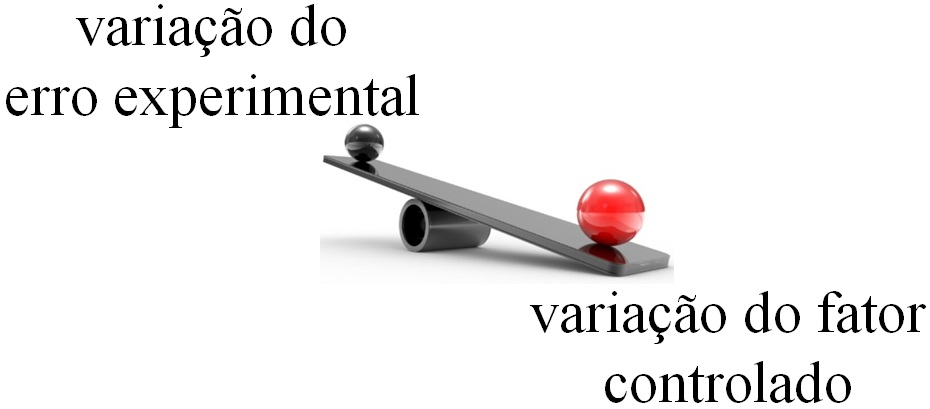
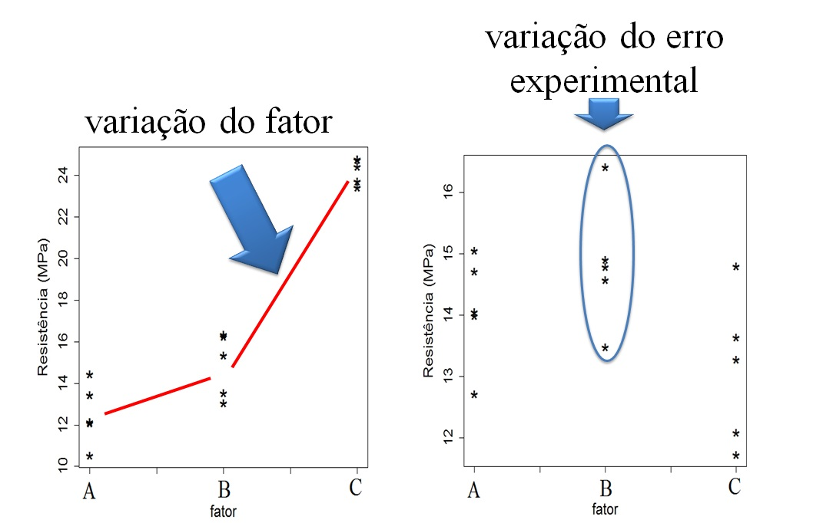
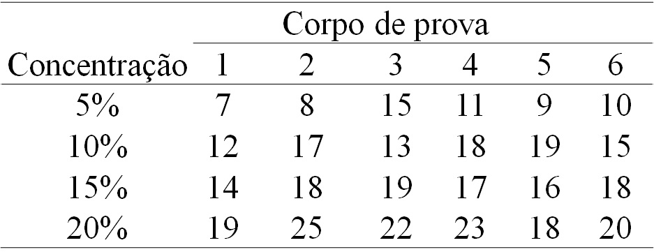

```{r setup, include=FALSE}
options(htmltools.dir.version = FALSE)
knitr::opts_chunk$set(echo = FALSE, 
                      comment = '',
                      message = FALSE,
                      warning = FALSE)
```
<style> 
#caixa {
  border: 1px solid;
  padding: 10px;
  box-shadow: 5px 10px blue;
}
div {
  text-align: justify;
  text-justify: inter-word;
}
</style>

# Motivação

<br>
<br>

<fieldset class="fldsetblock-class">
  <legend class="legendblock-class">
    Dados experimentais
  </legend>
 Vamos pensar em uma área de aplicação
</fieldset>

---

# Conceitos básicos

<fieldset class="fldsetalert-class">
  <legend class="legendalert-class">
    Erro experimental
  </legend>
  é a variação ao acaso entre observações.
</fieldset>

<br>

--

<fieldset class="fldsetalert-class">
  <legend class="legendalert-class">
    Fator
  </legend>
  é a variável independente controlada.
</fieldset>

<br>

--

<fieldset class="fldsetalert-class">
  <legend class="legendalert-class">
    Níveis
  </legend>
  são as categorias ou valores no domínio de um fator.
</fieldset>

---

<fieldset class="fldsetalert-class">
  <legend class="legendalert-class">
    Unidade experimental
  </legend>
  é o objeto que recebe os níveis.
</fieldset>

<br>

--

<fieldset class="fldsetalert-class">
  <legend class="legendalert-class">
    Variável resposta
  </legend>
  é a variável de dependente.
</fieldset>

<br>

--

<fieldset class="fldsetalert-class">
  <legend class="legendalert-class">
    Delineamento experimental
  </legend>
  é a forma como os níveis são designados a unidade experimental.
</fieldset>

---

<fieldset class="fldsetexample-class">
  <legend class="legendexample-class">
    Exercício
  </legend>
  Um fabricante de papel está interessado em melhorar a resistência do produto à tração.

	A engenharia de produto presume que a resistência à tração seja uma função da concentração da madeira de lei na polpa.<br/> 
	
	Um grupo de engenheiros responsáveis pelo estudo decide investigar quatro níveis de concentração de madeira de lei: 5%, 10%, 15% e 20%. <br/> 
	
	Eles decidem fabricar seis corpos de prova, para cada nível de concentração, usando uma planta piloto. Todos os 24 corpos de prova são testados, em uma ordem aleatória, em um equipamento de teste de laboratório.
</fieldset>

<br>
	De acordo com o enunciado, identifique os seguintes itens:
	
.pull-left[
- Fator e classifique;

- Nível;

- Unidade experimental;
]

.pull-right[
- Variável resposta;

- Delineamento experimental.
]
	
---

# Princípios básicos da experimentação

<fieldset class="fldsetalert-class">
  <legend class="legendalert-class">
    Repetição
  </legend>
  é o número de vezes que os níveis aparecem no experimento
</fieldset>

<br>

--

<fieldset class="fldsetalert-class">
  <legend class="legendalert-class">
    Aleatorização
  </legend>
  é o princípio de distribuir aleatoriamente os níveis nas unidades experimentais.
</fieldset>

<br>

--

<fieldset class="fldsetalert-class">
  <legend class="legendalert-class">
    Controle local
  </legend>
  é uma forma de controlar o fator de ruído.
</fieldset>

---

# Análise de variância (ANOVA)

- é uma análise baseado na decomposição da variabilidade total do experimento.

<br>

```{r,echo=FALSE, fig.align='center', out.width='75%'}

```

---

# Análise de variância (ANOVA)

- é uma análise baseado na decomposição da variabilidade total do experimento.

<br>

```{r,echo=FALSE, fig.align='center', out.width='75%'}

```

---

# Delineamento inteiramente casualizado

- **Não há** a presença de fatores de ruído

<br>

--

- O modelo é dado por

$$y_{ij}=\mu+\tau_i+e_{ij}$$
com $i=1,\ldots,a$ e $j=1,\ldots,r$.

--

- As hipóteses estatísticas são:

$H_0$:

$H_1$:

---

- A estatística do teste é dada por

```{r}
causa <- c('Fator','Resíduo','Total')
gl <- c('a-1','a(r-1)','ar-1')
sq <- c('SQFator','SQRes','SQTotal')
qm <- c('QMFator','QMRes','---')
f0 <- c('QMFator/QMRes','---','---')
dat <- data.frame(causa,gl,sq,qm,f0)

library(kableExtra)
dat |> 
  kbl(caption = 'Esquema da tabela da ANOVA',
      col.names = c('Causa de variação','Grau de liberdade','Soma de quadrados','Quadrado médio','f0')) |> 
  kable_classic(c("striped", "hover"))
```

---

# Verificação dos pressupostos

<fieldset class="fldsetalert-class">
  <legend class="legendalert-class">
    Anova - pressupostos
  </legend>
  - normalidade dos resíduos <br/>
  
  - homogeneidade de variâncias
</fieldset>

---

<fieldset class="fldsetexample-class">
  <legend class="legendexample-class">
    Exercício
  </legend>
  Um fabricante de papel está interessado em melhorar a resistência do produto à tração.

	A engenharia de produto presume que a resistência à tração seja uma função da concentração da madeira de lei na polpa.<br/> 
	
	Um grupo de engenheiros responsáveis pelo estudo decide investigar quatro níveis de concentração de madeira de lei: 5%, 10%, 15% e 20%. <br/> 
	
	Eles decidem fabricar seis corpos de prova, para cada nível de concentração, usando uma planta piloto. Todos os 24 corpos de prova são testados, em uma ordem aleatória, em um equipamento de teste de laboratório.
</fieldset>

```{r,echo=FALSE, fig.align='center', out.width='55%'}

```

Considerando um nível de significância de 5%, verifique se existe efeito da concentração de madeira sobre a resistência.

---

# Delineamento em blocos casualizados

- **Há** a presença de um fator de ruído

<br>

--

- O modelo é dado por

$$y_{ij}=\mu+\beta_j+\tau_i+e_{ij}$$
com $i=1,\ldots,a$ e $j=1,\ldots,b$.

--

- As hipóteses estatísticas são:

$H_0$:

$H_1$:

---

A estatística do teste é dada por

```{r}
causa <- c('Bloco','Fator','Resíduo','Total')
gl <- c('b-1','a-1','(a-1)(b-1)','ab-1')
sq <- c('SQBloco','SQFator','SQRes','SQTotal')
qm <- c('QMBloco','QMFator','QMRes','---')
f0 <- c('QMBloco/QMRes','QMFator/QMRes','---','---')
dat <- data.frame(causa,gl,sq,qm,f0)

dat |> 
  kbl(caption = 'Esquema da tabela da ANOVA',
      col.names = c('Causa de variação','Grau de liberdade','Soma de quadrados','Quadrado médio','f0')) |> 
  kable_classic(c("striped", "hover"))
```

---

<fieldset class="fldsetexample-class">
  <legend class="legendexample-class">
    Exercício
  </legend>
  xxx
</fieldset>

---

# Atividade 7

A energia elétrica consumida mensalmente por uma indústria química está relacionada com a temperatura média ambiente, o número de dia no mês, a pureza média do produto e as toneladas do produto produzido. Os dados históricos do ano passado estão disponíveis na planilha eletrônica energia_eletrica.xlsx.


---

```{r, fig.align='center'}
library(readxl)
dados <- read_excel('energia_eletrica.xlsx')
plot(dados)
```

---

# Próxima aula

.pull-left[

&#10004; Leitura Capítulo 14

]

.pull-right[
```{r,echo=FALSE, fig.align='center', out.width='65%'}
knitr::include_graphics('figuras/mont7.png')
```
]

