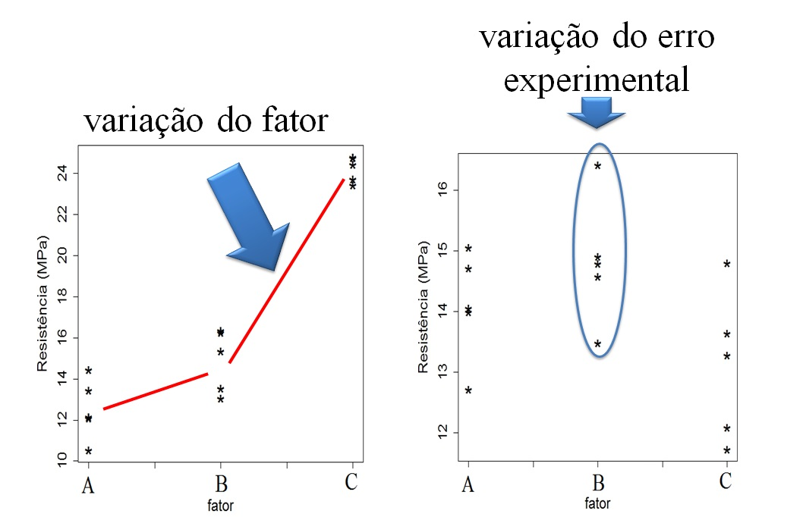
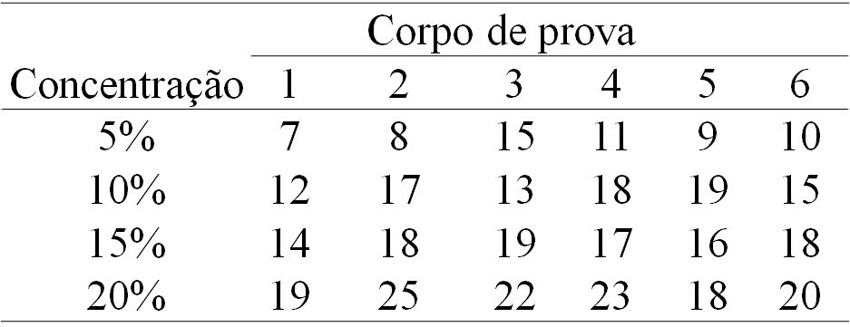

```{r setup, include=FALSE}
options(htmltools.dir.version = FALSE)
knitr::opts_chunk$set(echo = FALSE, 
                      comment = '',
                      message = FALSE,
                      warning = FALSE)
```
<style> 
#caixa {
  border: 1px solid;
  padding: 10px;
  box-shadow: 5px 10px blue;
}
div {
  text-align: justify;
  text-justify: inter-word;
}
</style>

<style type="text/css">
.remark-slide-content {
    font-size: 30px;
}
</style>

# Motivação

<br>
<br>

<fieldset class="fldsetblock-class">
  <legend class="legendblock-class">
    Dados experimentais
  </legend>
 Vamos pensar em uma área de aplicação
</fieldset>

---

# Conceitos básicos

<fieldset class="fldsetalert-class">
  <legend class="legendalert-class">
    Erro experimental
  </legend>
  é a variação ao acaso entre observações.
</fieldset>

<br>

--

<fieldset class="fldsetalert-class">
  <legend class="legendalert-class">
    Fator
  </legend>
  é a variável independente controlada.
</fieldset>

<br>

---

<fieldset class="fldsetalert-class">
  <legend class="legendalert-class">
    Níveis
  </legend>
  são as categorias ou valores no domínio de um fator.
</fieldset>

<br>

--

<fieldset class="fldsetalert-class">
  <legend class="legendalert-class">
    Unidade experimental
  </legend>
  é o objeto que recebe os níveis.
</fieldset>

<br>

---

<fieldset class="fldsetalert-class">
  <legend class="legendalert-class">
    Variável resposta
  </legend>
  é a variável de dependente.
</fieldset>

<br>

--

<fieldset class="fldsetalert-class">
  <legend class="legendalert-class">
    Delineamento experimental
  </legend>
  é a forma como os níveis são designados a unidade experimental.
</fieldset>

---

<fieldset class="fldsetexample-class">
  <legend class="legendexample-class">
    Exercício 1
  </legend>
  Um fabricante de papel está interessado em melhorar a resistência do produto à tração.

	A engenharia de produto presume que a resistência à tração seja uma função da concentração da madeira de lei na polpa.<br/> 
	
	Um grupo de engenheiros responsáveis pelo estudo decide investigar quatro níveis de concentração de madeira de lei: 5%, 10%, 15% e 20%. <br/> 
</fieldset>

---

<fieldset class="fldsetexample-class">
  <legend class="legendexample-class">
    Exercício 1 - continuação
  </legend>
	Eles decidem fabricar seis corpos de prova, para cada nível de concentração, usando uma planta piloto. Todos os 24 corpos de prova são testados, em uma ordem aleatória, em um equipamento de teste de laboratório.
</fieldset>

---
	De acordo com o enunciado, identifique os seguintes itens:
	
.pull-left[
- Fator;

- Nível;

- Unidade experimental;
]

.pull-right[
- Variável resposta;

- Delineamento experimental.
]
	
---

# Princípios básicos da experimentação

<fieldset class="fldsetalert-class">
  <legend class="legendalert-class">
    Repetição
  </legend>
  é o número de vezes que os níveis aparecem no experimento
</fieldset>

<br>

--

<fieldset class="fldsetalert-class">
  <legend class="legendalert-class">
    Aleatorização
  </legend>
  é o princípio de distribuir aleatoriamente os níveis nas unidades experimentais.
</fieldset>

<br>

---

<fieldset class="fldsetalert-class">
  <legend class="legendalert-class">
    Controle local
  </legend>
  é uma forma de controlar o fator de ruído.
</fieldset>

---

# Análise de variância (ANOVA)

- é uma análise baseado na decomposição da variabilidade total do experimento.

<br>

```{r,echo=FALSE, fig.align='center', out.width='75%'}
knitr::include_graphics('figuras/comparacao1.jpg')
```

---

# Análise de variância (ANOVA)

- é uma análise baseado na decomposição da variabilidade total do experimento.

```{r,echo=FALSE, fig.align='center', out.width='75%'}

```

---

# DIC

- **Não há** a presença de fatores de ruído

--

- O modelo é dado por

$$y_{ij}=\mu+\tau_i+\varepsilon_{ij}$$
com $i=1,\ldots,a$ e $j=1,\ldots,r$.

--

- As hipóteses estatísticas são:

$H_0$:

$H_1$:

---

- A estatística do teste é dada por

```{r}
causa <- c('Fator','Resíduo','Total')
gl <- c('a-1','a(r-1)','ar-1')
sq <- c('SQFator','SQRes','SQTotal')
qm <- c('QMFator','QMRes','---')
f0 <- c('QMFator/QMRes','---','---')
dat <- data.frame(causa,gl,sq,qm,f0)

library(kableExtra)
dat |> 
  kbl(caption = 'Esquema da tabela da ANOVA',
      col.names = c('Causa de variação','Grau de liberdade','Soma de quadrados','Quadrado médio','f0')) |> 
  kable_classic(c("striped", "hover"))
```

---

# Verificação dos pressupostos

<fieldset class="fldsetalert-class">
  <legend class="legendalert-class">
    Anova - pressupostos
  </legend>
  - normalidade dos resíduos <br/>
  
  - homogeneidade de variâncias
</fieldset>

---

<fieldset class="fldsetexample-class">
  <legend class="legendexample-class">
    Exercício 2
  </legend>
  Vamos considerar novamente, o experimento com concentração de matedeira de lei sobre a resistência à tração do papel.
</fieldset>

```{r,echo=FALSE, fig.align='center', out.width='70%'}

```

---

Considerando um nível de significância de 5%, verifique se existe efeito da concentração de madeira sobre a resistência.

---

```{r}
y <- c(7,8,15,11,9,10,
       12,17,13,18,19,15,
       14,18,19,17,16,18,
       19,25,22,23,18,20)
trat <- as.factor(c(rep('5p',6),rep('10p',6),
          rep('15p',6),rep('20p',6)))

fit <- lm(y~trat)
anova(fit)
```


---

# Teste de Tukey

- Teste de comparação múltipla, cujo objetivo é **identificar** quais médias são diferentes.

<br>

--

- As hipóteses estatísticas são:

$H_0$:

$H_1$:

---

<fieldset class="fldsetexample-class">
  <legend class="legendexample-class">
    Exercício 3
  </legend>
  No Exercício 2, verificamos que há efeito da concentração de madeira sobre a resistência à tração do papel. Neste contexto, ao nível de significância de 5%, faça o teste de Tukey.
</fieldset>

---

```{r}
fit_aov <- aov(fit)
TukeyHSD(fit_aov, "trat", ordered = TRUE)
```


---

# DBC

- **Há** a presença de um fator de ruído

--

- O modelo é dado por

$$y_{ij}=\mu+{\color{red}\beta_j}+\tau_i+\varepsilon_{ij}$$
com $i=1,\ldots,a$ e $j=1,\ldots,b$.

--

- As hipóteses estatísticas são:

$H_0$:

$H_1$:

---

A estatística do teste é dada por

```{r}
library(kableExtra)
causa <- c('Bloco','Fator','Resíduo','Total')
gl <- c('b-1','a-1','(a-1)(b-1)','ab-1')
sq <- c('SQBloco','SQFator','SQRes','SQTotal')
qm <- c('QMBloco','QMFator','QMRes','---')
f0 <- c('QMBloco/QMRes','QMFator/QMRes','---','---')
dat <- data.frame(causa,gl,sq,qm,f0)

dat |> 
  kbl(caption = 'Esquema da tabela da ANOVA',
      col.names = c('Causa de variação','Grau de liberdade','Soma de quadrados','Quadrado médio','f0')) |> 
  kable_classic(c("striped", "hover"))
```

---

<fieldset class="fldsetexample-class">
  <legend class="legendexample-class">
    Exercício 4
  </legend>
  Um experimento foi feito para determinar o efeito de quatro produtos químicos diferentes sobre a resistência de um tecido. Esses produtos químicos são usados como parte do processo de acabamento, sob prensagem permanente. Cinco amostras de tecido foram selecionadas e um PBCA foi corrido, testando cada tipo de produto químico uma vez, em uma ordem aleatória, em cada amostra de tecido. 
</fieldset>

---

<fieldset class="fldsetexample-class">
  <legend class="legendexample-class">
    Exercício 4 - continuação
  </legend>
  Teste o efeito do produto química sobre a resistência do tecido, considerando um nível de significância de 5%.
</fieldset>

---

<table frame="hsides" rules="rows" width="500" align="center">
    <tbody>
        <tr style="text-align: center;">
            <th colspan="1"></th>
            <th colspan="5">Amostra de tecido (bloco)</th>
        </tr>
        <tr style="text-align: center;">
            <td style="border-top-style: hidden;"> <b>Tipo de produto químico</b></td>
            <td>1</td>
            <td>2</td>
            <td>3</td>
            <td>4</td>
            <td>5</td>
        </tr>
        <tr style="text-align: center;">
            <td>1</td>
            <td>1,3</td>
            <td>1,6</td>
            <td>0,5</td>
            <td>1,2</td>
            <td>1,1</td>
        </tr>
        <tr style="text-align: center;">
            <td >2</td>
            <td>2,2</td>
            <td>2,4</td>
            <td>0,4</td>
            <td>2,0</td>
            <td>1,8</td>
        </tr>
        <tr style="text-align: center;">
            <td>3</td>
            <td>1,8</td>
            <td>1,7</td>
            <td>0,6</td>
            <td>1,5</td>
            <td>1,3</td>
        </tr>
        <tr style="text-align: center;">
            <td>4</td>
            <td>3,9</td>
            <td>4,4</td>
            <td>2,0</td>
            <td>4,1</td>
            <td>3,4</td>
        </tr>
    </tbody>
</table>

```{r, eval=FALSE}
y3 <- c(1.3,1.6,0.5,1.2,1.1,
        2.2,2.4,0.4,2.0,1.8,
        1.8,1.7,0.6,1.5,1.3,
        3.9,4.4,2.0,4.1,3.4)
trat3 <- as.factor(c(rep('T1',5),
                     rep('T2',5),
          rep('T3',5),rep('T4',5)))
bloco <- as.factor(rep(c(1,2,3,4,5),4))

fit3 <- lm(y3~bloco+trat3)
anova(fit3)
```

```{r, eval=FALSE}
fit3_aov <- aov(fit3)
TukeyHSD(fit3_aov, "trat3")
```

---

# Resolução

Sobre o experimento:

- **Fator**: tipo de produto químico

- **Nível**: tipo 1, tipo 2, tipo 3 e tipo 4 (quatro níveis)

- **Unidade experimental**: tecido

- **Variável resposta**: resistência

- **Delineamento experimental**: DBC, pois cinco amostras diferentes de tecido foram utilizadas.
	
---

* **Objetivo**: Identificar qual tipo de produto químico produz melhor resistência a um tecido.

* O **modelo** é dado por

$$y_{ij}=\mu+\beta_j+\tau_i+\varepsilon_{ij}, \quad i=1,\ldots,a \,\, \mbox{e} \,\,  j=1,\ldots,5,$$

em que $y$ é a resistência, $\mu$ é a média, $\beta$ é o efeito do bloco, $\tau$ é o efeito do tipo de produto químico e $\varepsilon$ é o erro experimental.

* **Método estatístico**: ANOVA para DBC

---
As hipóteses são

* $H_0$: não há efeito do tipo de produto químico sobre a resistência do tecido.

* $H_1$: há efeito do tipo de produto químico sobre a resistência do tecido.

O nível de significância foi fixo em $\alpha=0,05$.

O critério de rejeição é definido como:

* rejeitar $H_0$ se $p$-valor<0,05.

---
A estatística do teste obtida com o auxílio do *software* Jamovi é dada na seguinte tabela

```{r}
options(knitr.kable.NA = '')
library(kableExtra)
causa <- c('Bloco','Tipo','Resíduo')
gl <- c(4,3,12)
sq <- c(6.69, 18.04,0.95)
qm <- c(1.67,6.01,0.08)
f0 <- c(21.10,75.90,NA)
pvalor <- c('<0.01','<0.01',NA)
dat <- data.frame(causa,gl,sq,qm,f0,pvalor)

dat |> 
  kbl(caption = 'ANOVA da resistência do tecido',
      col.names = c('Causa de variação','Grau de liberdade','Soma de quadrados','Quadrado médio','f0','p-valor')) |> 
  kable_classic(c("striped", "hover"))
```

---
Ao nível de significância de 5%, rejeitamos $H_0$. Portanto, temos evidências que há efeito do tipo de produto químico sobre a resistência do tecido.

Para verificar os **pressupostos da ANOVA**, temos os seguintes testes:

* **normalidade dos resultados**

As hipóteses são

* $H_0$: os resíduos seguem distribuição normal.

---

* $H_1$: os resíduos seguem outra distribuição.

O nível de significância foi fixo em $\alpha=0,05$.

O critério de rejeição é definido como:

* rejeitar $H_0$ se $p$-valor<0,05.

A estatística do teste é dada na seguinte tabela

```{r}
teste <- c('Shapiro-Wilk')
estat <- c(0.98)
pvalor <- c(0.94)
dat <- data.frame(teste,estat,pvalor)

dat |> 
  kbl(caption = 'Teste de normalidade',
      col.names = c('Teste','Estatística do teste','p-valor')) |> 
  kable_classic(c("striped", "hover"))
```

---

Ao nível de significância de 5%, rejeitamos $H_0$. Portanto, temos evidências que há os resíduos são provenientes de uma distribuição normal.

* **homogeneidade de variâncias**

As hipóteses são

* $H_0$: as variâncias são homogêneas.

* $H_1$: as variâncias são heterôgeneas.

---

O nível de significância foi fixo em $\alpha=0,05$.

O critério de rejeição é definido como:

* rejeitar $H_0$ se $p$-valor<0,05.

A estatística do teste obtida com auxílio do *software* R é dada na seguinte tabela

```{r}
teste <- c('Levene')
estat <- c(0.45)
pvalor <- c(0.72)
dat <- data.frame(teste,estat,pvalor)

dat |> 
  kbl(caption = 'Teste de homogeneidade de variâncias',
      col.names = c('Teste','Estatística do teste','p-valor')) |> 
  kable_classic(c("striped", "hover"))
```

---

Ao nível de significância de 5%, rejeitamos $H_0$. Portanto, temos evidências que há homogeneidade de variâncias.

Portanto, como os pressupostos foram atendidos, observamos que o modelo é adequado aos dados experimentais.

---

Então, ao nível de significância de 5%, temos os seguintes resultados pelo teste de Tukey.

```{r}
tipo <- c('T4','T2','T3','T1')
media <- c(3.56,1.76,1.38,1.14)
grupo <- c('a','b','bc','c')
dat <- data.frame(tipo,media,grupo)

dat |> 
  kbl(caption = 'Teste de Tukey',
      col.names = c('Tipo','Média','Grupo')) |> 
  kable_classic(c("striped", "hover"))
```

<!--


# Experimentos fatoriais

- **Há** mais de um fator no experimento.

--

- Considerar experimentos com **dois** fatores. 

--

- O modelo é dado por

$$y_{ijk}=\mu+\tau_i+\alpha_j+(\tau\alpha)_{ij}+e_{ijk}$$
com $i=1,\ldots,a$, $j=1,\ldots,b$ e $k=1,\ldots,r$.

--

- As hipóteses estatísticas são:

$H_0$:

$H_1$:

---

- Se **há** efeito de interação entre os fatores:

  - desdobramento dos níveis

--
  
- Se **não há** efeito de interação entre os fatores:

  - os efeitos principais são **estudados separadamente**.
  
---

A estatística do teste é dada por

```{r}
library(kableExtra)
causa <- c('FatorA','FatorB','Interação','Resíduo','Total')
gl <- c('b-1','a-1','(a-1)(b-1)','ab(r-1)','abr-1')
sq <- c('SQA','SQB','SQInt','SQRes','SQTotal')
qm <- c('QMA','QMB','QMInt','QMRes','---')
f0 <- c('QMA/QMRes','QMB/QMRes','QMInt/QMRes','---','---')
dat <- data.frame(causa,gl,sq,qm,f0)

dat |> 
  kbl(caption = 'Esquema da tabela da ANOVA',
      col.names = c('Causa de variação','Grau de liberdade','Soma de quadrados','Quadrado médio','f0')) |> 
  kable_classic(c("striped", "hover"))
```

---

<fieldset class="fldsetexample-class">
  <legend class="legendexample-class">
    Exercício 4
  </legend>
  Considere as combinações de dois fatores na remoção de sujeira em roupas típicas de lavanderia. O primeiro fator é a marca do sabão em pó (X, Y e Z). O segundo fator é a temperatura da água, quente ou morna. Cada combinação de nível foi repetido três vezes e a variável resposta é a porcentagem de sujeira removida. Os dados são mostrados a seguir
  
---
  
</fieldset>

<table frame="hsides" rules="rows" width="400" align="center">
    <tbody>
        <tr style="text-align: center;">
            <th colspan="1">Marca</th>
            <th colspan="1">Temperatura</th>
            <th colspan="3">Repetição</th>
        </tr>
        <tr style="text-align: center;">
            <td>X</td>
            <td>Quente</td>
            <td>85</td>
            <td>88</td>
            <td>80</td>
        </tr>
        <tr style="text-align: center;">
            <td style="border-top-style: hidden;"> </td>
            <td>Morna</td>
            <td>82</td>
            <td>83</td>
            <td>85</td>
        </tr>
        <tr style="text-align: center;">
            <td>Y</td>
            <td>Quente</td>
            <td>90</td>
            <td>92</td>
            <td>92</td>
        </tr>
        <tr style="text-align: center;">
            <td style="border-top-style: hidden;"> </td>
            <td>Morna</td>
            <td>88</td>
            <td>86</td>
            <td>88</td>
        </tr>
        <tr style="text-align: center;">
            <td>Z</td>
            <td>Quente</td>
            <td>85</td>
            <td>87</td>
            <td>88</td>
        </tr>
        <tr style="text-align: center;">
            <td style="border-top-style: hidden;"></td>
            <td>Morna</td>
            <td>76</td>
            <td>74</td>
            <td>78</td>
        </tr>
    </tbody>
</table>

Teste os efeitos sobre a porcentagem de sujeira removida, considerando um nível de significância de 5%.

---

```{r}
y4 <- c(85,88,80,
        82,83,85,
        90,92,92,
        88,86,88,
        85,87,88,
        76,74,78)
marca <- as.factor(c(rep('x',6),rep('y',6),
           rep('z',6)))
temp <- as.factor(c(rep('quente',3),rep('morna',3),
          rep('quente',3),rep('morna',3),
          rep('quente',3),rep('morna',3)))
fit4 <- lm(y4~marca+temp+marca*temp)
anova(fit4)
```

-->