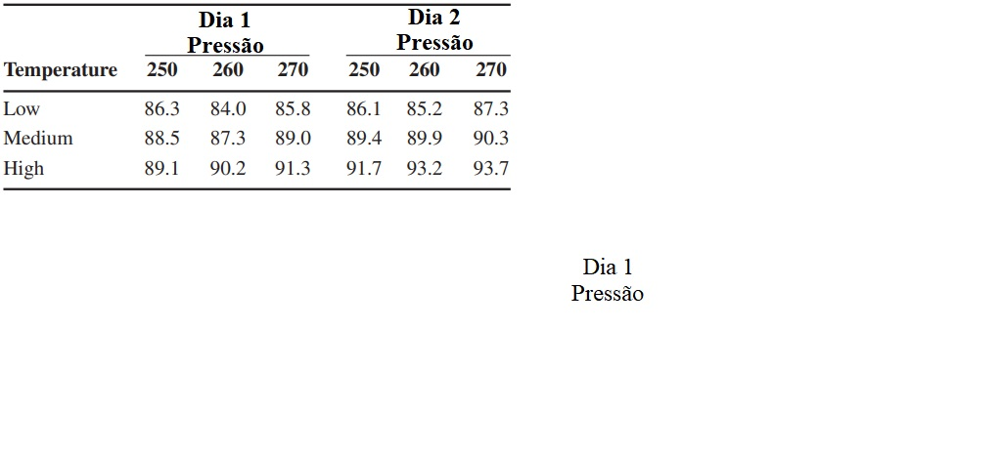

```{r setup, include=FALSE}
options(htmltools.dir.version = FALSE)
knitr::opts_chunk$set(echo = FALSE, 
                      comment = '',
                      message = FALSE,
                      warning = FALSE)
```
<style> 
#caixa {
  border: 1px solid;
  padding: 10px;
  box-shadow: 5px 10px blue;
}
div {
  text-align: justify;
  text-justify: inter-word;
}
</style>

# Delineamento em blocos casualizados

- **Há** a presença de um fator de ruído

<br>

--

- O modelo é dado por

$$y_{ij}=\mu+\beta_j+\tau_i+e_{ij}$$
com $i=1,\ldots,a$ e $j=1,\ldots,b$.

--

- As hipóteses estatísticas são:

$H_0$:

$H_1$:

---

A estatística do teste é dada por

```{r}
library(kableExtra)
causa <- c('Bloco','Fator','Resíduo','Total')
gl <- c('b-1','a-1','(a-1)(b-1)','ab-1')
sq <- c('SQBloco','SQFator','SQRes','SQTotal')
qm <- c('QMBloco','QMFator','QMRes','---')
f0 <- c('QMBloco/QMRes','QMFator/QMRes','---','---')
dat <- data.frame(causa,gl,sq,qm,f0)

dat |> 
  kbl(caption = 'Esquema da tabela da ANOVA',
      col.names = c('Causa de variação','Grau de liberdade','Soma de quadrados','Quadrado médio','f0')) |> 
  kable_classic(c("striped", "hover"))
```

---

<fieldset class="fldsetexample-class">
  <legend class="legendexample-class">
    Exercício
  </legend>
  Um experimento foi feito para determinar o efeito de quatro produtos químicos diferentes sobre a resistência de um tecido. Esses produtos químicos são usados como parte do processo de acabamento, sob prensagem permanente. Cinco amostras de tecido foram selecionadas e um PBCA foi corrido, testando cada tipo de produto químico uma vez, em uma ordem aleatória, em cada amostra de tecido. Os dados são mostrados na seguinte tabela. Teste o efeito do produto química sobre a resistência do tecido, considerando um nível de significância de 5%.
</fieldset>

```{r,echo=FALSE, fig.align='center', out.width='70%'}

```

---

# Experimentos fatoriais

---

# Atividade 8

A demanda química de oxigênio foi usada como resposta e três valores diferentes para o tempo de eletrólise foram considerados. Os seguintes dados foram obtidos de experimento conduzido de acordo com o delineamento em blocos casualizados, sendo os valores iniciais de pH os blocos.

- pH inicial 3:

  - 15 min de eletrólise: 77,1 
  
  - 30 min de eletrólise: 80,1
  
  - 45 min de eletrólise: 82,8 
  
- pH inicial 7:

  - 15 min de eletrólise: 75,2 
  
  - 30 min de eletrólise: 76,8
  
  - 45 min de eletrólise: 75,2
  
---
  
- pH inicial 11:

  - 15 min de eletrólise: 42,2 
  
  - 30 min de eletrólise: 45,0
  
  - 45 min de eletrólise: 46,8


