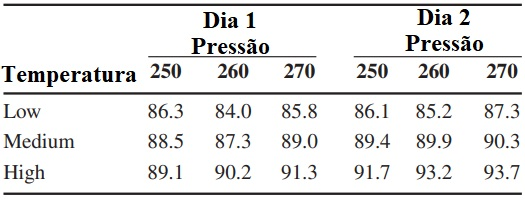

```{r setup, include=FALSE}
options(htmltools.dir.version = FALSE)
knitr::opts_chunk$set(echo = FALSE, 
                      comment = '',
                      message = FALSE,
                      warning = FALSE)
```
<style> 
#caixa {
  border: 1px solid;
  padding: 10px;
  box-shadow: 5px 10px blue;
}
div {
  text-align: justify;
  text-justify: inter-word;
}
</style>

# Experimentos fatoriais

- **Há** mais de um fator no experimento.

--

- Considerar experimentos com **dois** fatores. 

<br>

--

- O modelo é dado por

$$y_{ijk}=\mu+\tau_i+\alpha_j+(\tau\alpha)_{ij}+e_{ijk}$$
com $i=1,\ldots,a$, $j=1,\ldots,b$ e $k=1,\ldots,r$.

--

- As hipóteses estatísticas são:

$H_0$:

$H_1$:

---

- Se **há** efeito de interação entre os fatores:

  - desdobramento dos níveis

--
  
- Se **não há** efeito de interação entre os fatores:

  - os efeitos principais são **estudados separadamente**.
  
--

A estatística do teste é dada por

```{r}
library(kableExtra)
causa <- c('FatorA','FatorB','Interação','Resíduo','Total')
gl <- c('b-1','a-1','(a-1)(b-1)','ab(r-1)','abr-1')
sq <- c('SQA','SQB','SQInt','SQRes','SQTotal')
qm <- c('QMA','QMB','QMInt','QMRes','---')
f0 <- c('QMA/QMRes','QMB/QMRes','QMInt/QMRes','---','---')
dat <- data.frame(causa,gl,sq,qm,f0)

dat |> 
  kbl(caption = 'Esquema da tabela da ANOVA',
      col.names = c('Causa de variação','Grau de liberdade','Soma de quadrados','Quadrado médio','f0')) |> 
  kable_classic(c("striped", "hover"))
```

---

<fieldset class="fldsetexample-class">
  <legend class="legendexample-class">
    Exercício 2
  </legend>
  Considere as combinações de dois fatores na remoção de sujeira em roupas típicas de lavanderia. O primeiro fator é a marca do sabão em pó (X, Y e Z). O segundo fator é a temperatura da água, quente ou morna. Cada combinação de nível foi repetido três vezes e a variável resposta é a porcentagem de sujeira removida. Os dados são mostrados a seguir
  
</fieldset>

<table frame="hsides" rules="rows" width="400" align="center">
    <tbody>
        <tr style="text-align: center;">
            <th colspan="1">Marca</th>
            <th colspan="1">Temperatura</th>
            <th colspan="3">Repetição</th>
        </tr>
        <tr style="text-align: center;">
            <td>X</td>
            <td>Quente</td>
            <td>85</td>
            <td>88</td>
            <td>80</td>
        </tr>
        <tr style="text-align: center;">
            <td style="border-top-style: hidden;"> </td>
            <td>Morna</td>
            <td>82</td>
            <td>83</td>
            <td>85</td>
        </tr>
        <tr style="text-align: center;">
            <td>Y</td>
            <td>Quente</td>
            <td>90</td>
            <td>92</td>
            <td>92</td>
        </tr>
        <tr style="text-align: center;">
            <td style="border-top-style: hidden;"> </td>
            <td>Morna</td>
            <td>88</td>
            <td>86</td>
            <td>88</td>
        </tr>
        <tr style="text-align: center;">
            <td>Z</td>
            <td>Quente</td>
            <td>85</td>
            <td>87</td>
            <td>88</td>
        </tr>
        <tr style="text-align: center;">
            <td style="border-top-style: hidden;"></td>
            <td>Morna</td>
            <td>76</td>
            <td>74</td>
            <td>78</td>
        </tr>
    </tbody>
</table>

Teste os efeitos sobre a porcentagem de sujeira removida, considerando um nível de significância de 5%.

---

# ANOVA

```{r}
y4 <- c(85,88,80,
        82,83,85,
        90,92,92,
        88,86,88,
        85,87,88,
        76,74,78)
marca <- as.factor(c(rep('x',6),rep('y',6),
           rep('z',6)))
temp <- as.factor(c(rep('quente',3),rep('morna',3),
          rep('quente',3),rep('morna',3),
          rep('quente',3),rep('morna',3)))
fit4 <- lm(y4~marca+temp+marca*temp)
anova(fit4)
```

---

# Pressuposto da ANOVA

* Teste de normalidade 

```{r}
teste <- c('Shapiro-Wilk')
estat <- c(0.96)
pvalor <- c(56)
dat <- data.frame(teste,estat,pvalor)

dat |> 
  kbl(caption = 'Teste de normalidade',
      col.names = c('Teste','Estatística do teste','p-valor')) |> 
  kable_classic(c("striped", "hover"))
```

* Teste de homogeneidade de variâncias 


```{r}
teste <- c('Levene')
estat <- c(1,63)
pvalor <- c(0.23)
dat <- data.frame(teste,estat,pvalor)

dat |> 
  kbl(caption = 'Teste de homogeneidade de variâncias',
      col.names = c('Teste','Estatística do teste','p-valor')) |> 
  kable_classic(c("striped", "hover"))
```

---

# Teste de Tukey

```{r}
fit4_aov <- aov(fit4)
TukeyHSD(fit4_aov, "marca:temp")
```


---

# Atividade 8

O rendimento de um processo químico está sendo estudado. o
dois fatores de interesse são temperatura e pressão. Três níveis de cada fator são selecionados; no entanto, apenas nove execuções podem ser
feito em um dia. O experimentador executa uma réplica completa
do desenho em cada dia. Os dados são mostrados a seguir
tabela. Analise os dados, assumindo que os dias são blocos e considerando um nível de significância de 5%.

```{r,echo=FALSE, fig.align='center', out.width='50%'}

```

---

# Experimentos ao longo do tempo