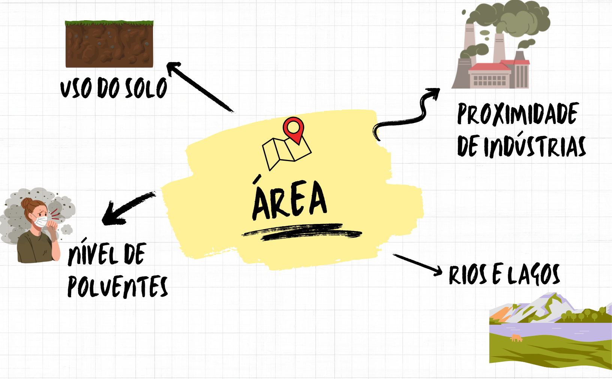

```{r setup, include=FALSE}
options(htmltools.dir.version = FALSE)
knitr::opts_chunk$set(echo = FALSE, 
                      comment = '',
                      message = FALSE,
                      warning = FALSE)
```
<style> 
#caixa {
  border: 1px solid;
  padding: 10px;
  box-shadow: 5px 10px blue;
}
div {
  text-align: justify;
  text-justify: inter-word;
}
</style>

<style type="text/css">
.remark-slide-content {
    font-size: 30px;
}
</style>

# Modelo de classificação

Em Engenharia Ambiental, muitas vezes precisamos classificar dados em categorias, como:

--

.pull-left[

- Contaminado

```{r , echo=FALSE, fig.align = 'center', out.width = '50%'}
knitr::include_graphics('https://i.giphy.com/media/v1.Y2lkPTc5MGI3NjExcHg4djB4Z3R4a2g3cm02MDVpeWUxaXVzOHpwbTE4djM1OWYxYzNpOSZlcD12MV9pbnRlcm5hbF9naWZfYnlfaWQmY3Q9Zw/OLEFkLMQJ5v1btVbRn/giphy.gif')
```
]
.pull-right[

- Não contaminado

```{r , echo=FALSE, fig.align = 'center', out.width = '65%'}
knitr::include_graphics('https://i.giphy.com/media/v1.Y2lkPTc5MGI3NjExNnF5eWl4ZGhmYnQ2cnRsdnJ1OHhlN3ZhMDN4aWoydnJmdzd3b2huMiZlcD12MV9pbnRlcm5hbF9naWZfYnlfaWQmY3Q9Zw/l1KVcrdl7rJpFnY2s/giphy.gif')
```
]

--

<center>Modelo de regressão logística</center>

---

- Fazer uma previsão

```{r , echo=FALSE, fig.align = 'center', out.width = '85%'}

```

---

# Modelo de regressão logística

- Utiliza para modelar a **probabilidade de um evento**.

A função logística é dada por

$$P(Y=1|\mathbf{X})=\frac{1}{1+e^{-(\beta_0+\beta_1x_1+\ldots,\beta_px_p)}}$$

--

O resultado do modelo é uma probabilidade entre 0 e 1. 

--

<!-- Por exemplo, se o modelo retorna 0.7, isso significa que há 70% de chance de a área estar contaminada. -->

- **Decisão de Classificação**: definir um limite (*threshold*). Comumente, utilizamos 0,5.
<!-- e a probabilidade for maior que 0.5, classificamos como "contaminado"; caso contrário, "não contaminado". -->

--

- **Curva ROC e acurácia**: métricas.

---

# Roteiro para o modelo de regressão logística

- Determine as medidas resumo (média, mediana, desvio padrão, máximo e mínimo)

- Estimar os parâmetros do modelo

- Obter a tabela de classificação

- Calcular as métrica

- Apresentar o modelo estimado

.pull-left[
]
.pull-right[
```{r , echo=FALSE, fig.align = 'center', out.width = '40%'}
knitr::include_graphics('https://i.giphy.com/media/v1.Y2lkPTc5MGI3NjExMmZvYXZieWxqZnVrMmJucDlvNTF5ZjR4bjN2dHAwcmwyeDN3czI1YiZlcD12MV9pbnRlcm5hbF9naWZfYnlfaWQmY3Q9Zw/HZrx8kjIA7lyeTqXVM/giphy.gif')
```
]

---

# Exemplo 

Neste exercício, você deverá desenvolver um modelo de regressão logística com o objetivo de prever o risco de deslizamento de terra em diferentes áreas com base em variáveis ambientais. A partir de um conjunto de dados que contém informações sobre precipitação, vegetação, declive do terreno, cobertura do solo e distância de áreas urbanizadas, o modelo deve ser capaz de classificar as áreas como "alto risco" ou "baixo risco" para deslizamentos.

**Variável resposta**:

- Deslizamento: Risco de deslizamento

---

**Variáveis** explicativas:

- Precipitação: Quantidade de chuva diária (mm/dia).

- NDVI (Índice de Vegetação): Indica a quantidade de vegetação na área.

- Declive (%): Inclinação do terreno.

- Cobertura (%): Percentual de cobertura de vegetação na área.

- Distância(km): Distância até a cidade mais próxima.

- dados: dados_deslizamento.xlsx

---

# Análise de agrupamentos

- Amostra de dados

```{r , echo=FALSE, fig.align = 'center', out.width = '50%'}
knitr::include_graphics('https://i.giphy.com/media/v1.Y2lkPTc5MGI3NjExdzByeXR1emZyMW12MDhodnViZjd1eWlpeXJ5MmZuYmtrdXU0ajJtdCZlcD12MV9pbnRlcm5hbF9naWZfYnlfaWQmY3Q9Zw/l6Sn8PdGcJmhhGtg5A/giphy.gif')
```

---

- Separação dos dados

```{r , echo=FALSE, fig.align = 'center', out.width = '50%'}
knitr::include_graphics('https://i.giphy.com/media/v1.Y2lkPTc5MGI3NjExOGt3NW4waGJuMzYyYzgzbTllODh6MHh5ZXR5ZTYwZDJ6N2xuanBkdCZlcD12MV9pbnRlcm5hbF9naWZfYnlfaWQmY3Q9Zw/AhAPELQvciG498lt0w/giphy.gif')
```

---

# Razões para fazer agrupamentos

- Identificar regiões com características ambientais semelhantes

--

- Agrupar períodos de ano com comportamento climáticos ou poluição semelhantes

--

- Identificar grupos de espécies que compartilham preferências de habitat semelhantes

--

- Identificar áreas prioritárias para a conservação de biodiversidade ou para o controle de poluição.

---

# Algoritmos de agrupamentos

- **Método hierárquico**

  + não precisa especificar o número de grupos
  
  + vários métodos de agrupamento
  
  + dendograma
  
  + menos eficientes para tamanho de amostras grandes

---

- **Método particionado: k-means**

  + precisa especificar o número de grupos
  
  + distância euclidiana
  
  + mais eficientes para tamanho de amostras grandes

---

# Exemplo

O objetivo deste exercício é realizar uma análise de agrupamento entre diferentes cidades, agrupando-as de acordo com cinco variáveis ambientais e urbanísticas: a quantidade de partículas finas de PM 2,5, a área verde disponível, a temperatura média anual, a área desmatada e o consumo médio de água.

- dados: dados_cidades

---

# Atividade 1

O objetivo deste estudo é prever o risco de poluição do ar em áreas urbanas com base em variáveis ambientais e urbanísticas. Ao analisar variáveis como a concentração de dióxido de nitrogênio $(NO_2)$, índice de tráfego, índice de vegetação (NDVI), temperatura média e proximidade de áreas industriais, podemos prever a probabilidade de uma área ser classificada como alto risco de poluição do ar. (dados_poluicao_ar.xlsx)

**Variável resposta**:

- Poluição: Risco de Poluição do Ar. A classificação é baseada na concentração de poluentes e outros fatores que contribuem para a deterioração da qualidade do ar.

---

**Variáveis explicativas**:

- NO2 $(\mu g/m^3)$: A concentração de dióxido de nitrogênio no ar. 

- Tráfego (veículos/dia): O número médio de veículos que passam por uma área em um dia. 

- NDVI: Um índice que mede a densidade e saúde da vegetação na área. 

- Temperatura: A temperatura média (graus Celsius) da área pode afetar a dispersão dos poluentes no ar. 

- Distância (km): A proximidade de áreas industriais.

---

# Atividade 2

Você é um pesquisador em Ciências Ambientais, envolvido em um estudo para classificar diferentes tipos de florestas em uma região com base em atributos ecológicos. Para isso, você possui um conjunto de dados simulados que descrevem várias características ambientais de 37 áreas florestais.

As variáveis incluem características como densidade de árvores, taxa de crescimento, espécies dominantes, umidade do solo, temperatura média e acidez do solo. A partir desses dados, seu objetivo é aplicar um algoritmo de agrupamento para identificar as florestas que são semelhantes.

- dados: dados_florestas