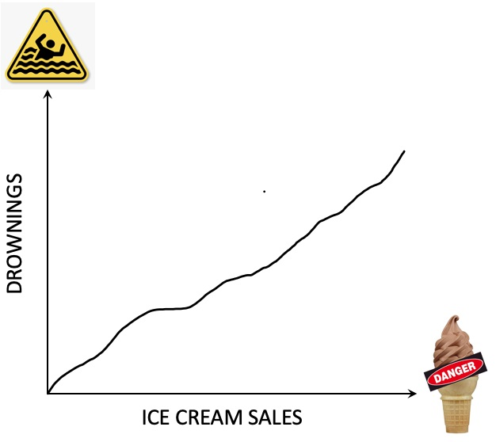

```{r setup, include=FALSE}
options(htmltools.dir.version = FALSE)
knitr::opts_chunk$set(echo = FALSE, 
                      comment = '',
                      message = FALSE,
                      warning = FALSE)
```
<style> 
#caixa {
  border: 1px solid;
  padding: 10px;
  box-shadow: 5px 10px blue;
}
div {
  text-align: justify;
  text-justify: inter-word;
}
</style>

<style type="text/css">
.remark-slide-content {
    font-size: 30px;
}
</style>

# Modelo de regressão

```{r , echo=FALSE, fig.align = 'center', out.width = '70%'}
knitr::include_graphics('https://media.giphy.com/media/v1.Y2lkPTc5MGI3NjExNmlqY3J1bTc0Nnc3ZmRsdWQxNTdoejluMWp1b2Y0dXIwYnUwM2UxYyZlcD12MV9pbnRlcm5hbF9naWZfYnlfaWQmY3Q9Zw/RCtKcMeeIlIFskmH7C/giphy.gif')
```

--

- **Variáveis** associada à um fenômeno

--

- Fazer uma **representação matemática**

<center><small>variável resposta = variáveis explicativas + termo aleatório </small></center>

---

# Modelo de regressão

&#127919; Estudar a **associação** entre duas ou mais variáveis.


```{r, out.width="50%",fig.align='center'}
df <- mtcars
m <- lm(mpg~wt, data=df)
yhat <- m$coefficients[[1]]+(m$coefficients[[2]]*df$wt)

library(ggplot2)
df |> 
  dplyr::mutate(yhat) |> 
  ggplot() +
  aes(x = wt, y = mpg) +
  geom_point(size = 8) +
  labs(x = 'Valores de x', 
       y = 'Valores y') +
  theme(axis.title = element_text(size=30),
        axis.text = element_text(size=30))
```

--

- Relação **linear** entre as variáveis.

---

# Correlação de Pearson

- Quantificar o grau de relação entre duas variáveis quantitativas.

```{r}
rho <- c('0,00 a 0,19', '0,20 a 0,39',
         '0,40 a 0,69', '0,70 a 0,89',
         '0,90 a 1,00')
interp <- c('Correlação bem fraca',
            'Correlação fraca',
            'Correlação moderada',
            'Correlação forte',
            'Correlação muito forte') 
df <- data.frame(rho,interp)

df |> 
  kableExtra::kbl(col.names = c('Valores','Interpretação'),
                  align = c('c')) |> 
  kableExtra::kable_classic(full_width = F, html_font = "Cambria") |> 
  kableExtra::footnote(general = "http://leg.ufpr.br/~silvia/CE003/node74.html ")
```

---

# Cuidado com a Interpretação

```{r , echo=FALSE, fig.align = 'left', out.width = '25%'}
knitr::include_graphics('https://i.giphy.com/media/v1.Y2lkPTc5MGI3NjExZTYzajA1dzk2bzdmMW55eXZtNXRpbHlzYzl4M2EwcDZpbmJncTE5OCZlcD12MV9pbnRlcm5hbF9naWZfYnlfaWQmY3Q9Zw/3ov9k9Ss9N3wO6FQ7C/giphy.gif')
```

.pull-left[
"A venda de sorte é fortemente correlacionada com o número de afogamentos."
]
.pull-right[
```{r , echo=FALSE, fig.align = 'center', out.width = '90%'}

```
]

---

# Explicação

```{r , echo=FALSE, fig.align = 'center', out.width = '100%'}
knitr::include_graphics('figuras/cor_vs_casual.png')
```
<center><small>https://estatisticafacil.org/correlacao-vs-causalidade/</small></center>

---

# Modelo de regressão linear simples

- **Uma** variável explicativa 

```{r, out.width="50%",fig.align='center', fig.cap='Gráfico de dispersão'}
df <- mtcars
m <- lm(mpg~wt, data=df)
yhat <- m$coefficients[[1]]+(m$coefficients[[2]]*df$wt)

library(ggplot2)
df |> 
  dplyr::mutate(yhat) |> 
  ggplot() +
  aes(x = wt, y = mpg) +
  geom_point(size = 8) +
  labs(x = 'Valores de x', 
       y = 'Valores y') +
  theme(axis.title = element_text(size=30),
        axis.text = element_text(size=30))
```

---

# Modelo de regressão linear múltipa

- **Duas** variáveis explicativas  

```{r}
mm <- lm(mpg~+disp+wt, data=df)
ymhat <- mm$coefficients[[1]]+
  (mm$coefficients[[2]]*df$disp)+
  (mm$coefficients[[3]]*df$wt)

library(plotly)
df_novo <- df |> 
  dplyr::mutate(ymhat)

p <- plot_ly(
  df_novo, 
  x = ~wt, y = ~mpg, z = ~disp) |> 
  add_markers() |> 
  layout(
    scene = list(xaxis = list(title = 'Valores de x1'),
        yaxis = list(title = 'Valores de y'),
        zaxis = list(title = 'Valores de x2'))
        )

htmltools::tagList(p)
```

---

# Adequação do modelo

<center>variável resposta = variáveis explicativas + termo aleatório </center>

--

Usando **notação matemática**:

$$y=\beta_0+\beta_1x_1+\ldots\beta_px_p+\varepsilon$$
em que o erro aleatório satisfaz as seguintes características:

--

- segue distribuição normal com média zero e variância $\sigma^2$.

--

- a variância deve ser constante.

--

- os erros devem ser independentes.

---

# Roteiro da análise de regressão

- Fazer um gráfico de dispersão;

--

- Determinar a correlação entre as variáveis;

--

- Estimar o modelo de regressão linear

--

- Análise de resíduo:
  - Teste de normalidade
  
  - Teste de homogeneidade de variâncias
  
  As hipóteses a serem testadas são
  
  $H_0$: as variâncias são homogêneas vs   $H_1$: as variâncias são heterogêneas
  
---
- Análise de resíduo:

  - Teste de Durbin-Watson
  
  As hipóteses são
  
  $H_0$: os erros são independentes vs   $H_1$: os erros são dependentes

---

# Exemplo

Na engenharia de recursos hídricos, a estimativa dos tamanhos dos reservatórios depende de estimativas acuradas do escoamento da água no rio que está sendo confinado. Em alguns rios, registros históricos de longa duração de tais dados de escoamento são difíceis de obter. Já os dados meteorológicos sobre precipitação estão disponíveis para muitos anos do passado. Portanto, é útil determinar a relação entre escoamento e precipitação.

---

Essa relação pode ser usada para fazer uma estimativa do escoamento nos anos nos quais apenas medidas de precipitação foram feitas. Os seguintes dados estão disponíveis para um rio que deve ser estancado:

- Precipitação:
```{r}
x <- c(117.4,123.2,94.3,	91.7,	111.5,	
112.0,	
94.1,	
110.8)
x
```

- Escoamento:
```{r}
y <- c(19.6,18.5,
17.1,
12.9,
18.4,
18.1,
15.5,
18.1)
y
```

---

# Modelo de classificação

Em Engenharia Ambiental, muitas vezes precisamos classificar dados em categorias, como:

--

.pull-left[

- Contaminado

```{r , echo=FALSE, fig.align = 'center', out.width = '50%'}
knitr::include_graphics('https://i.giphy.com/media/v1.Y2lkPTc5MGI3NjExcHg4djB4Z3R4a2g3cm02MDVpeWUxaXVzOHpwbTE4djM1OWYxYzNpOSZlcD12MV9pbnRlcm5hbF9naWZfYnlfaWQmY3Q9Zw/OLEFkLMQJ5v1btVbRn/giphy.gif')
```
]
.pull-right[

- Não contaminado

```{r , echo=FALSE, fig.align = 'center', out.width = '65%'}
knitr::include_graphics('https://i.giphy.com/media/v1.Y2lkPTc5MGI3NjExNnF5eWl4ZGhmYnQ2cnRsdnJ1OHhlN3ZhMDN4aWoydnJmdzd3b2huMiZlcD12MV9pbnRlcm5hbF9naWZfYnlfaWQmY3Q9Zw/l1KVcrdl7rJpFnY2s/giphy.gif')
```
]

--

<center>Modelo de regressão logística</center>

---

- Fazer uma previsão

```{r , echo=FALSE, fig.align = 'center', out.width = '85%'}
knitr::include_graphics('figuras/classificar.png')
```

---

# Modelo de regressão logística

- Utiliza para modelar a **probabilidade de um evento**.

A função logística é dada por

$$P(Y=1|\mathbf{X})=\frac{1}{1+e^{-(\beta_0+\beta_1x_1+\ldots,\beta_px_p)}}$$

--

O resultado do modelo é uma probabilidade entre 0 e 1. 

--

<!-- Por exemplo, se o modelo retorna 0.7, isso significa que há 70% de chance de a área estar contaminada. -->

- **Decisão de Classificação**: definir um limite (*threshold*). Comumente, utilizamos 0,5.
<!-- e a probabilidade for maior que 0.5, classificamos como "contaminado"; caso contrário, "não contaminado". -->

---

# Ajuste do modelo

- **Treinamento**: Utilizamos um conjunto de dados rotulados (com áreas conhecidas como contaminadas ou não) para treinar o modelo, ajustando os coeficientes betas.

--

- **Validação**: Avaliamos o modelo com um conjunto de testes e utilizamos métricas como precisão, sensibilidade e especificidade para medir o desempenho.

---

# Exemplo 

