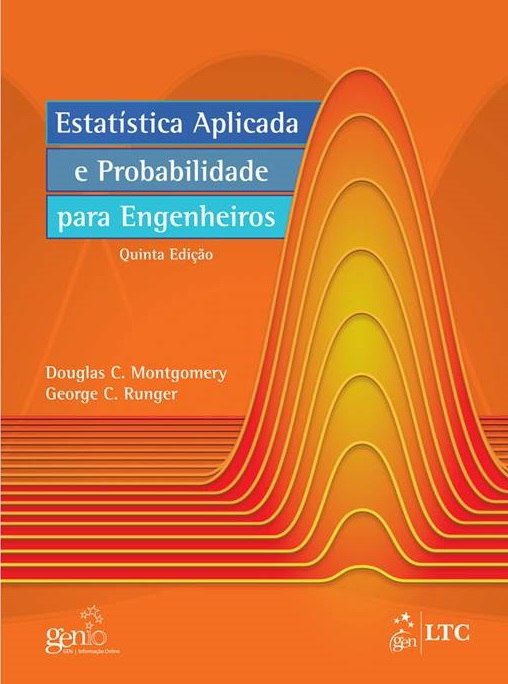

```{r setup, include=FALSE}
options(htmltools.dir.version = FALSE)
knitr::opts_chunk$set(echo = FALSE, 
                      comment = '',
                      message = FALSE,
                      warning = FALSE,
                      cache = TRUE)
```
<style> 
#caixa {
  border: 1px solid;
  padding: 10px;
  box-shadow: 5px 10px blue;
}
div {
  text-align: justify;
  text-justify: inter-word;
}
</style>

# Porque estudar Estatística &#128526;

<!--acrescentar embed no link dos videos-->

<center>
<iframe width="560" height="315" src="https://www.youtube.com/embed/wV0Ks7aS7YI" frameborder="0" allow="accelerometer; autoplay; encrypted-media; gyroscope; picture-in-picture" allowfullscreen></iframe>
</center>

---

# Objetivo da disciplina &#127919;

Proporcionar o aluno de pós-graduação o desenvolvimento da capacidade de interpretar os resultados e avaliar criticamente os métodos estatísticos utilizados. 

---

# Conteúdo programático

- Apresentação da disciplina e revisão de conceitos básicos

- Visualização de dados

- Intervalos de confiança

- Teste de hipóteses: paramétrico e não paramétrico

- Análise de variância: DIC e DBC

- Análise de variância: esquema fatorial e parcela subdividida

- Modelos de regressão

---

# Referências &#128218;

&#10004; MONTGOMERY, Douglas C.; Runger, George G. **Estatística Aplicada e Probabilidade para Engenharias**. 6ed. John Wiley \& Sons, 2016.

```{r , eval = TRUE, echo=FALSE, fig.align = 'center', out.width = '35%'}

```

---

&#10004; BUSSAB, Wilton de Oliveira; MORETTIN, Pedro Alberto. **Estatística básica**. 5ed. São Paulo: Saraiva, 2004. 526 p.

```{r , eval = TRUE, echo=FALSE, fig.align = 'center', out.width = '35%'}
knitr::include_graphics('figuras/fig8.jpg')
```

---

# Critério de avaliação &#128220;

&#10004; Será aprovado o aluno que obtiver média final maior ou igual a 6 $(MF\geq6)$, em que
		$$MF=0,6NR+0,2NA+0,2NQ,$$
em que $NR$ é a nota de um resumo expandido, $NA$ é a nota média de atividades e $NR$ é a nota média de quizes. 

---

# Moodle &#127891;

&#10004; <https://moodle.utfpr.edu.br/login/index.php>

<br>

&#10004; Londrina - Pós graduação: especialização - Especialização em Engenharia Ambiental - 2017

<br>

&#10004; Disciplina: 2022 - S2 - Estatística Aplicada

<br>

&#10004; Senha: PPGEA2022

---

# Questionário &#128221;

- Acessar o moodle e responder um questionário.

```{r, eval=TRUE}
countdown::countdown(minutes = 15, seconds = 0, 
          top = 0, right = 0,
          font_size = "3em")
```


